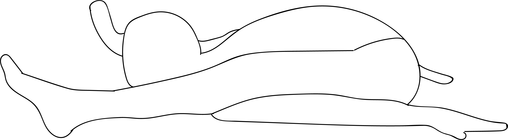

# Uttana Kurmasana

[TOC]

**Uttana Kurmasana** is an Asana. It is translated as Inverted Tortoise Pose from Sanskrit. The name of this pose comes from **uttana** meaning **intense stretch**, **kurma** meaning **tortoise**, and **asana** meaning **posture** or **seat**.

## Technique
1. Start from the position of Vajrasana .
1. Now take a forward bend and rest your head on the ground.
1. Let your nose closer to your knees and streatch your arms back to your feet.
1. Your hands and feet should rest parallel to each other and palms should be facing upwards.

## Technique in pictures/animation
## Effects
* Helps to open out the thighs, hips, back and shoulders.
* Increases concentration since it keeps the focus of the mind inwards.
* Useful in various ailments of neck.
* Helps in the improvement of the respiratory rate.
* Even reduces down the bulkiness in and around the abdomen.
* Also increases the blood flow to the brain.
* Very beneficial for those suffering from constipation, indigestion and nervous weakness.

## Related Asanas
* [Uttanasana](../yoga/Uttanasana.md)
* [Paschimottanasana](../yoga/Paschimottanasana.md)
* [Dhanurasana](../yoga/Dhanurasana.md)

## Special requisites
* Should not be practiced by a person with recent or chronic injury to the hips, shoulders, neck or back.
* Also if suffering from muscle pull should not practice this asana.
* This is also a good exercise to control irregular menstruation or painful cramps on or during the menstruation period.
* This is also a fat shedder which is evident as one bends down and massages the stomach holding in the organs with a locked inhale.

## Initial practice notes
Kurmasana is an advanced pose, and it takes a certain amount of time to get into it appropriately. Do it under the guidance of a yoga instructor to make it easier for you.

This is one of the Asanas prescribed in [Hatha Yoga Pradipika](Hatha_Yoga_Pradipika_(book).md).

## References

## External Links
* [Uttana Kurmasana on herbalcureindia.com](http://www.herbalcureindia.com/yoga-journal/uttana-kurmasana.html)
* [Uttana Kurmasana on stylesatlife.com](http://stylesatlife.com/articles/uttana-kurmasana/)
* [Uttana Kurmasana on ayurwiki.org](http://ayurwiki.org/index.php?title=Uttana_Kurmasana&action=edit)

## References

1. ["Methodology"](http://yoga.omgyan.com/posture/Uttana-Kurmasana.html)
2. [tips"]("Beginers)(http://www.stylecraze.com/articles/kurmasana-tortoise-pose-steps-and-benefits/#Beginners’Tips)
3. [benefits"]("Health)(https://www.indianetzone.com/54/uttana_kurmasana.htm)
