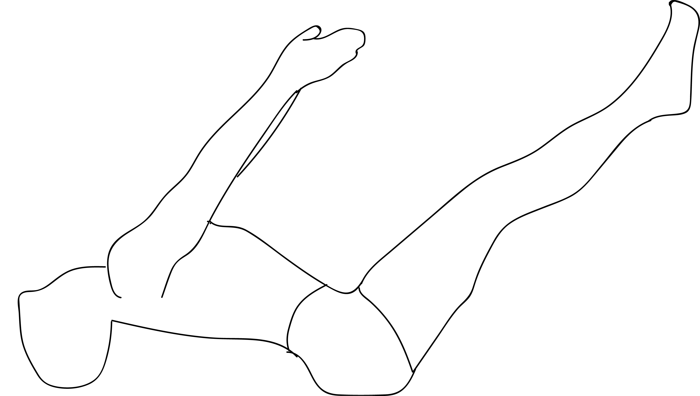

# Uttanapadasana

[TOC]

**Uttanapadasana**, **Uttanpadasana, Utthanpadasana, Uttana padasana** , or **Raised Legs Pose** is an asana where a person lies supine with the legs, held together, raised straight upwards. The name comes from the Sanskrit words uttana  meaning **intense stretch** or **straight** or **stretched** and pada  meaning **leg** or **foot**, and asana  meaning **posture** or **seat**

.

## Technique
1. Lie flat on your back as shown in the above image and breathe normally.
1. Place your hand on either side and palms should be facing down.
1. Inhale slowly and lift the legs at 45 – 60 degree from the ground.
1. Hold this posture for some time (15-20 sec) to feel pressure in lower abs.
1. While exhaling (Breath out ) relaxes your posture by lowering legs i.e. (Starting position)
1. Repeat this for 3-4 times daily.

## Technique in pictures/animation
## Effects
* It also calms the nervous weakness and brings a sense of calmness in the body.
* Uttana Padasana also relieves tension in shoulders, neck and throat.
* It relieves stress and anxiety.
* Uttana Padasana or Raised Leg Pose is also said to improve posture.
* It also improves blood circulation in whole body.
* Uttana Padasana also improves the functioning of reproductive system.

## Related Asanas
* [Adho Mukha Svanasana](../yoga/Adho_Mukha_Svanasana.md)

## Special requisites
It is essential to practice this pose correctly to avoid injury.

* If you are suffering from a neck injury, it might be a good idea to use a thickly folded blanket to support the head.
* You must ensure your spine is absolutely straight while practicing this asana to avoid any kind of injury.
* Pregnant women and women who are menstruating must avoid practicing this asana.
* People suffering from high blood pressure and knee injuries should also avoid this asana.

## Initial practice notes
Practice the Asana in morning and also in the evening on an empty stomach for best health benefits. When you reach to the point where you are able to hold your breath for 1 to 3 minutes, your Asana position will be complete.

## References

## External Links
* [Uttanapadasana on  yanunlimited.com](http://www.gyanunlimited.com/health/raised-leg-yoga-pose-uttanpadasana-steps-benefits-and-images/11409/)
* [Uttanapadasana on simpleyogaathome.com](http://simpleyogaathome.com/how-uttanapadasana-got-its-name/)
* [Uttanapadasana on thehealthsite.com](http://www.thehealthsite.com/fitness/uttanapadasana-beat-premature-ejaculation-and-stomach-ailments-with-this-asana-p314/)

## References

1. ["Methodology"](https://eyogaguru.com/uttanpadasana-leg-raised-pose-benefits-and-steps/)
2. [benefits"](https://www.epainassist.com/yoga/uttana-padasana-or-raised-leg-pose"Health)
