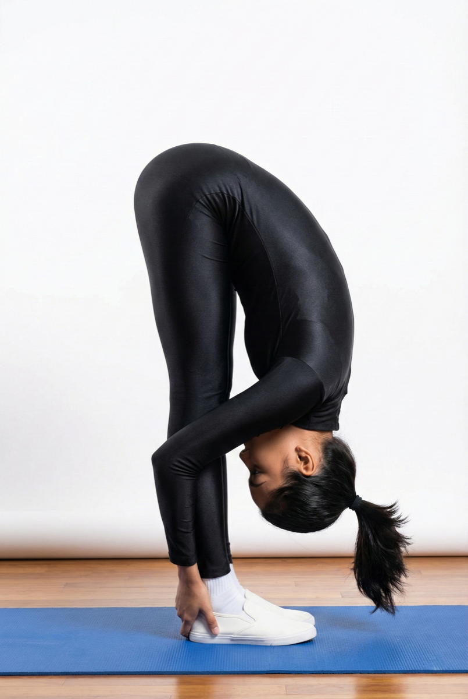

# Uttanasana

[TOC]

**Uttanasana** Intense Forward-Bending Pose, Intense Stretch Pose, Standing Forward Bend, Standing Forward Fold Pose, or Standing Head to Knees Pose is an asana.

## Technique
1. Begin with Tadasana, the upright pose. Stand straight with your arms actively resting on the sides of your thighs.
1. Keeping your breathing in check, without bending your knees, bend forward using your hip joints and not your waist.
1. If you are unable to touch the ground with your hands, cross your forearms and hold your elbows until you attain flexibility.
1. If you are moderately flexible, try to grip the back of your ankles and bring your head to touch your knees.
1. If your flexibility is above average, you may rest your palms on the mat and try to reach your head below the knee.
1. Beginners may hold the position for about 10 seconds. Intermediate and advanced practitioners may stay for 30 seconds to 1 minute in Uttanasana.
1. Breathe only through the nostrils, gently and normally, throughout the pose.
1. Inhale while coming back up to the starting position and exhale to relax.

## Technique in pictures/animation
## Effects
* Stretches the hips, hamstrings, and calves
* Strengthens the thighs and knees
* Keeps your spine strong and flexible
* Reduces stress, anxiety, depression, and fatigue
* Calms the mind and soothes the nerves
* Relieves tension in the spine, neck, and back
* Activates the abdominal muscles

## Related Asanas
* [Adho Mukha Svanasana](../yoga/Adho_Mukha_Svanasana.md)
* [Janu Sirsasana](../yoga/Janu_Sirsasana.md)
* [Paschimottanasana](../yoga/Paschimottanasana.md)

## Special requisites
Avoid this asana if you have the following problems:

* A lower back injury
* A tear in the hamstrings
* Sciatica
* Glaucoma or a detached retina

## Initial practice notes
As a beginner, it might be hard to increase the stretch. To make it easier, gently bend your knees, and imagine the sacrum sinking deep into the back part of the pelvis.

## References

## External Links
* [Uttanasana on doyouyoga.com](https://www.doyouyoga.com/top-5-uttanasana-variations-and-their-health-benefits/)
* [Uttanasana on yogapedia.com](https://www.yogajournal.com/poses/standing-forward-bend)
* [Uttanasana on rishikulyogshala.org](https://www.rishikulyogshala.org/top-7-health-benefits-of-uttanasana-standing-forward-bend-pose/)

## References

1. ["Methodology"](https://arogyayogaschool.com/blog/health-benefits-of-uttanasana-standing-forward-bend/)
2. [tips"]("Beginers)(http://www.stylecraze.com/articles/uttanasana-standing-forward-bend-pose/#Beginner’sTip)
3. [benefits"]("Health)(http://www.cnyhealingarts.com/2011/03/14/the-health-benefits-of-uttanasana-standing-forward-bend-pose/)
