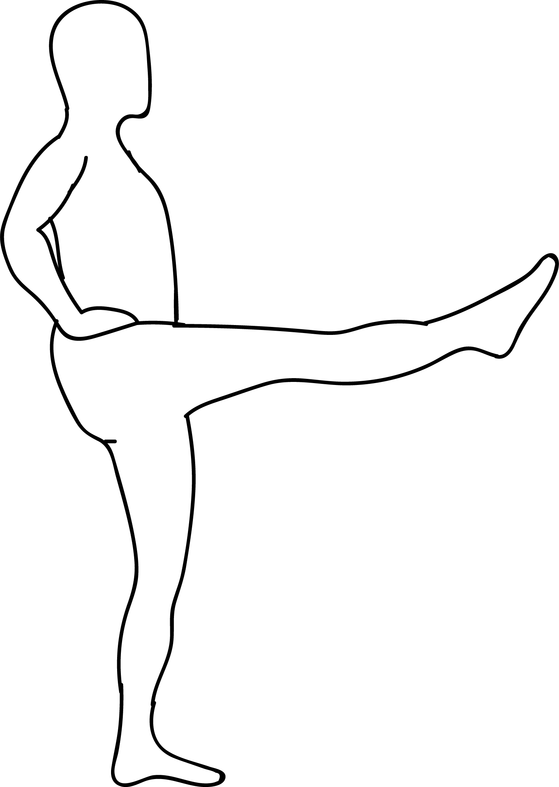

# Utthita Ekapadasana

[TOC]

**Utthita Ekapadasana** is a Yoga Asana. It is translated as **Extended One Leg Pose** from **Sanskrit**. The name of this pose comes from **utthita** meaning **extended**, **eka** meaning **one**, **pada** meaning **foot**, and **asana** meaning **posture** or **seat**.

## Technique
1. Stand straight and raise your hands above the head. Inhale while raising your hand, expanding the chest.
1. Interlock the fingers and hold the hands together.
1. Bend forward slowly with arms stretched out in front of you. Exhale while bending forward.
1. Simultaneously, raise the left leg and take it backwards.
1. Keep bending forward till your body is parallel to the ground. At the same time, take your left leg backwards so that it is perpendicular to the right leg.
1. The entire body weight is supported on the left foot alone.
1. In the final pose, the hands, body, trunk and legs are in a straight line, parallel to the ground. The whole body is perpendicular or at 90 degrees to the right leg looking like a “T”.
1. Maintain this position as per your comfort level. During the final position you can breathe normally. Concentrate on the sense of balance and try to maintain this position for as long as you can.
1. Repeat the same with the other leg, in which case the entire body weight is supported by the left foot alone.

## Technique in pictures/animation
## Effects
* This asana strengthens the arms, wrists, back, hips and leg muscles.
* It improves muscle coordination, balance and concentration.
* This asana shapes and tones the legs.
* It strengthens the ankle joints.
* It relaxes the lower back.

## Related Asanas
* [Supta Padangusthasana](../yoga/Supta_Padangusthasana.md)
* [Supta Virasana](../yoga/Supta_Virasana.md)
* [Uttanasana](../yoga/Uttanasana.md)

## Special requisites
It is essential to practice this pose correctly to avoid injury:

* Ankle or low back injuries.

## Initial practice notes
* If you find it difficult to hold your feet, use a yoga strap by looping it around the middle arch.
* When you do this asana, you might let your tailbone arch towards the ceiling. But you have to make sure your tailbone is pressed to the floor. Only then, the hips flexibility will increase.

## References

## External Links
* [Utthita Ekapadasana on naturehomeopathy.com](https://www.naturehomeopathy.com/utthita-padasana-procedure-and-benefits.html)
* [Utthita Ekapadasana on my-yoga-blog.blogspot.com](https://my-yoga-blog.blogspot.com/2014/03/utthita-eka-padasana.html)
* [Utthita Ekapadasana on asanajournal.com](https://www.asanajournal.com/utthita-dwipada-vrstasana-lifted-open-angle-pose/)

## References

1. ["Methodology"](http://www.yogicwayoflife.com/eka-padasana-one-foot-pose/)
2. [tips"]("Beginers)(https://www.yogajournal.com/poses/extended-hand-to-big-toe-pose)
3. [benefits"]("Health)(https://gulfnews.com/leisure/yoga/eka-padasana-improves-concentration-1.819862)
