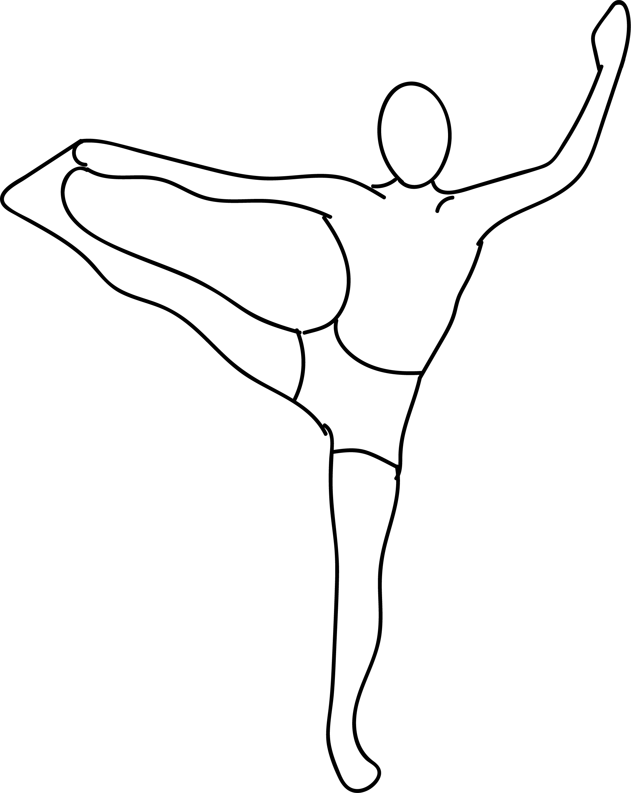

# Utthita Hasta Padangustasana

[TOC]

**Utthita Hasta Padangustasana** is an Asana. It is translated as Extended Hand to Big Toe Pose from Sanskrit. The name of this pose comes from **utthita** meaning **extended**, **hasta** meaning **hand**, **pada** meaning **leg** or **foot**, **angusta** meaning **big toe**, and **asana** meaning **posture** or **seat**.

## Technique
1. From Samasthiti, inhale place left hand on waist and with the right hand catch the right big toe. If possible straighten both knees and spine (if not possible to straighten right knee then hold toe with knee bent). If you are new to this posture stay here, if you can go further, exhale and touch your chin to your shin. Hold 5 breaths.
1. Inhale stand up straight, exhale take your leg to the side keeping (if possible) the arm, leg, and spine straight. Turn gaze over left shoulder. Hold 5 breaths.
1. Inhaling bring the leg to center, exhale touch the nose to the knee, inhale stand up straight, release leg with both hands on waist hold leg up as high as possible for 5 breaths (toes point).
1. Exhale to Samasthiti.

## Technique in pictures/animation
## Effects
* Helps with reducing weight off the body
* Helps the digestive organs and relieves indigestion
* Holistically boosts metabolism
* Gives revitalized energy and strength to the nervous system
* Sharpens the center within the thyroid gland
* Relieves anxiety.

## Related Asanas
* [Supta Padangusthasana](../yoga/Supta_Padangusthasana.md)
* [Supta Virasana](../yoga/Supta_Virasana.md)
* [Uttanasana](../yoga/Uttanasana.md)

## Special requisites
It is essential to practice this pose correctly to avoid injury.

* Ankle injuries
* Lower back injuries
* Tight hamstrings

## Initial practice notes
You can hold this pose longer by supporting the raised-leg foot on the top edge of a chair back (padded with a blanket). Set the chair an inch or two from a wall and press your raised heel firmly to the wall.

## References

## External Links
* [Utthita Hasta Padangustasana on harmonyyoga.com](http://harmonyyoga.com/the-benefits-of-utthita-hasta-padangustasana)
* [Utthita Hasta Padangustasana on gaia.com](https://www.gaia.com/article/extended-hand-toe-pose-utthita-hasta-padangusthasana)
* [Utthita Hasta Padangustasana on spotebi.com](https://www.spotebi.com/exercise-guide/extended-hand-to-big-toe-pose/)

## References

1. ["Methodology"](https://www.befityoga.com/2011/08/utthita-hasta-padangusthasana/)
2. [tips"]("Beginers)(https://www.yogajournal.com/poses/extended-hand-to-big-toe-pose)
3. [benefits"]("Health)(https://www.gaia.com/article/extended-hand-toe-pose-utthita-hasta-padangusthasana)
