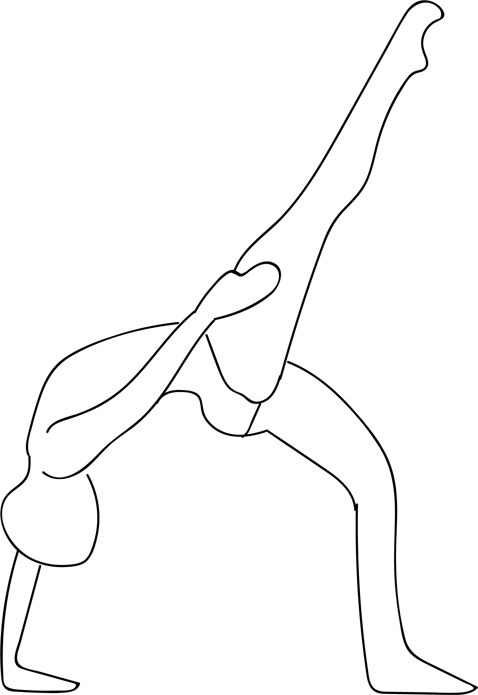

# Utthita Parshva Pashasana

[TOC]

**Utthita Parshva Pashasana**  is an Asana. It is translated as ***Extended Side Noose Pose*** from **Sanskrit**.

The name of this pose comes from "utthita" meaning "extended", "parshva" meaning "side", "pasha" meaning "noose", and "asana" meaning "posture" or "seat". This pose is a variation of Pasasana.

## Benefits
1. It stretched the outside of the thigh and the side of the body
1. Promotes spinal flexibility and balance.

## Cautions
* It is recommended to be cautious while doing this pose if you have any spinal, knee, ankle, or hip injuries.

## References

## References

1. ["wikipedia"](https://en.wikipedia.org/wiki/Utthita_Parshva_Pashasana)
