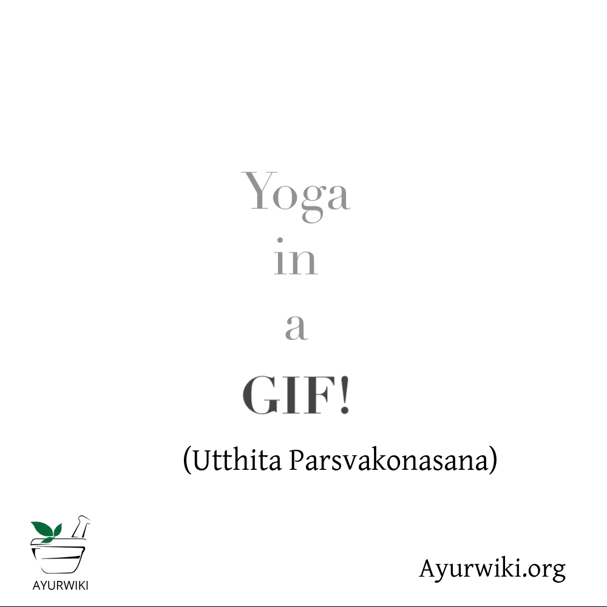

# Utthita Parsvakonasana

[TOC]

The name **Utthita Parsvakonasana** comes from Sanskrit where **Utthita** means **Extended**, **Parsva** means **side** or **flank**, **Kona** means **Angle** and **Asana** is **pose**.

## Technique
1. Start in Tadasana (Mountain Pose). On an exhalation, step your feet 3–4 feet apart. If you feel as though your feet are slipping, shorten your stance slightly. (If your legs are too far apart, it’s difficult to find stability. As you gain flexibility, you can widen your stance.) Rest your hands on your hips. Turn your right foot out so that your toes face the front of your mat; turn your left foot slightly in. Align your right heel with your left heel.
1. Engage your quadriceps muscles by lifting your kneecaps toward your thighs. Bend your right knee to bring your right shin and thigh to a 90-degree angle with your right kneecap in line with your right ankle.
1. On an inhalation, extend your arms out to your sides. Then, reach them up overhead and lengthen through your sides. Allow your pelvis to shift: Rotate your left hip slightly forward, and shift your right hip back as you begin to fold to the right. Keep your torso and spine long as you side bend.
1. Place your right hand to the outside of your right foot. Sweep and extend your left arm over your left ear, maintaining a straight line from your left foot all the way up to your left fingertips. Your palm should be facing down. Attempt to widen your collarbones to create space between your left shoulder and left ear.
1. Press through your outer left foot. Keep your head neutral, or turn it to gaze at your left thumb. Hold here for 5–10 breaths. Repeat on the other side.

## Effects
* Utthita Parvakonasana strengthens the thighs, the knees, legs and ankles.
* It is good for developing stamina and endurance
* It develops the sense of balance.
* It tones the organs in the abdomen and improves intestinal peristalsis, relieving constipation.
* It expands the thorax improving lung capacity.
* Utthita Parvakonasana stretches the waist and the groin muscles.

## Related Asanas
* [Adho Mukha Svanasana](../yoga/Adho_Mukha_Svanasana.md)
* [Supta Baddha Konasana](../yoga/Supta_Baddha_Konasana.md)
* [Prasarita Padottanasana](../yoga/Prasarita_Padottanasana.md)
* [Siddhasana](../yoga/Siddhasana.md)

## Special requisites
Avoid this asana if you have the following conditions:
* Headache
* High or low blood pressure
* Insomnia

## Initial practice notes
* Keep your heels anchored to the floor as you bend the front knee in the pose, and
* Touch the fingertips of the lowered hand on the floor

## References

## External Links
* [Utthita Parsvakonasana on yogaoutlet.com](https://www.yogaoutlet.com/guides/how-to-do-extended-side-angle-pose-in-yoga)
* [Utthita Parsvakonasana on ekhartyoga.com](https://www.ekhartyoga.com/articles/pose-of-the-week-extended-side-angle-pose-utthita-parsvakonasana)
* [Utthita Parsvakonasana on gaia.com](https://www.gaia.com/article/extended-side-angle-pose-utthita-parsvakonasana)

## References

1. ["Methodology"](https://www.yogajournal.com/poses/5-steps-master-utthita-parsvakonasana)
2. [tips"]("Beginers)(http://www.stylecraze.com/articles/extended-side-angle-pose-how-to-do-and-what-are-its-benefits/#Beginner’sTip)
3. [benefits"]("Health)(http://www.yogicwayoflife.com/utthita-parsvakonasana-extended-side-angle-pose/)
