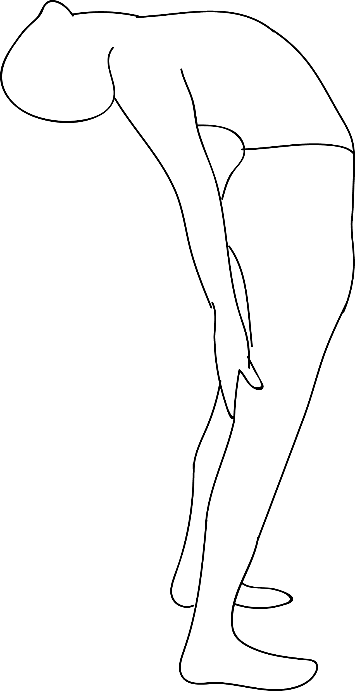

# Utthita Stiti Bhujangasana

[TOC]

**Utthita Stiti Bhujangasana** is an Asana. It is translated as Standing Rising Cobra Pose from Sanskrit. The name of this pose comes from **utthita** meaning **extended**, **stiti** meaning **standing**, **bhujanga** meaning **cobra**, and **asana** meaning **posture** or **seat**. This pose is a variation of Bhujangasana in a standing backbend in Tadasana.

## Technique
1. Lie flat on your back. Inhale and lift your legs up, bringing both your knees close to your chest.
1. Hold your big toes. Make sure your arms are pulled through the insides of your knees as you hold your toes. Gently open up your hips and widen your legs to deepen the stretch.
1. Tuck your chin into your chest and make sure your head is on the floor.
1. Press the tailbone and the sacrum down to the floor while you press your heels up, pulling back with your arms.
1. Press both the back of the neck and the shoulders down to the floor. The whole area of the back and the spine should be pressed flat on the floor.
1. Breathe normally and hold the pose for about 30 seconds to a minute.
1. Exhale and release your arms and legs. Lie on the floor for a few seconds before you move on to the next asana.

## Technique in pictures/animation
## Effects
This pose has the following benefits: it opens the front shoulder head and the chest muscles. It promotes spinal flexibility.

## Related Asanas
* [Adho Mukha Svanasana](../yoga/Adho_Mukha_Svanasana.md)
* [Supta Baddha Konasana](../yoga/Supta_Baddha_Konasana.md)
* [Prasarita Padottanasana](../yoga/Prasarita_Padottanasana.md)
* [Siddhasana](../yoga/Siddhasana.md)

## Special requisites
Be careful while doing this pose if you have any spinal or shoulder injuries.

## Initial practice notes
* If you find it difficult to hold your feet, use a yoga strap by looping it around the middle arch.
* When you do this asana, you might let your tailbone arch towards the ceiling. But you have to make sure your tailbone is pressed to the floor. Only then, the hips flexibility will increase.

## References

## External Links
* [Utthita Stiti Bhujangasana on mryoga.com](http://mryoga.com/rising-standing-cobra-pose/)
* [Utthita Stiti Bhujangasana on ipfs.io](https://ipfs.io/ipfs/QmXoypizjW3WknFiJnKLwHCnL72vedxjQkDDP1mXWo6uco/wiki/Utthita_Stiti_Bhujangasana.html)

## References

1. ["Methodology"](http://www.stylecraze.com/articles/ananda-balasana-benefits/#HowToDoThisAsana)
2. [tips"]("Beginers)(http://www.stylecraze.com/articles/ananda-balasana-benefits/#BeginnersTips)
3. [benefits"]("Health)(https://ipfs.io/ipfs/QmXoypizjW3WknFiJnKLwHCnL72vedxjQkDDP1mXWo6uco/wiki/Utthita_Stiti_Bhujangasana.html)
