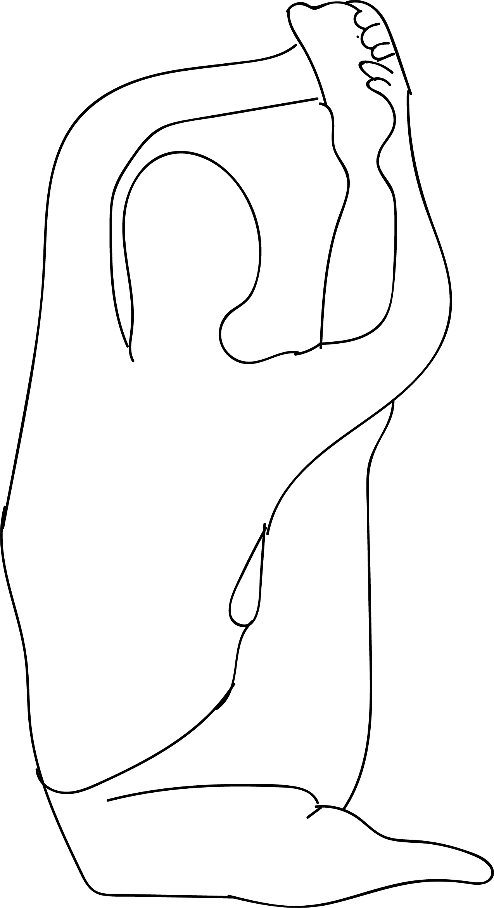

# Utthita Stiti Surya Yantrasana

[TOC]

**Utthita Stiti Surya Yantrasana** is an Asana. It is translated as Extended Standing Sundial Pose from Sanskrit.

The name of this pose comes from "utthita" meaning "extended", "stiti" meaning "standing", "surya yantra" meaning "sun dial", and "asana" meaning "posture" or "seat".

## Technique
1. Start in Sukhasana (Easy pose).
1. Keeping the left leg bent and grounded into the mat, place your right hand down in front of your left shin.
1. Bring your right knee up toward your chest, and attempt to draw your right shoulder under the crease of the knee. Aim to bring the knee as high as possible on the shoulder.
1. Take the left hand and reach for the outer edge of the right foot.
1. Inhale and begin to extend your right knee while simultaneously drawing the left arm behind your head. Ground down into your sitting bones as you exhale.
1. Hold this pose for up to 10 slow breaths. Use your inhales to lengthen the spine and exhales to deepen the stretch.
1. To exit Compass pose, inhale and lengthen your spine. Then exhale, release the foot, and bend the right knee to slowly dissolve out of the posture. Repeat on the opposite side.

## Technique in pictures/animation
## Effects
* Parivrtta Surya Yantrasana stretches out the groin, shoulders, spine, and hamstrings and opens up your hips.
* Right execution the Asana may stretch the tissue of the lung meridian which is good for respiratory organs.
* Strengthens your spine, lower back, and limbs along with improves the flexibility of your muscle.
* Compass Pose Improves your digestion and cleanses your digestive organs.
* Parivrtta Surya Yantrasana is beneficial for your liver and kidneys.Improves muscle flexibility.

## Related Asanas
* [Janu Sirasana](Janu_Sirasana.md)
* [Uttanasana](../yoga/Uttanasana.md)

## Special requisites
* Be careful while doing this pose if you have any spinal injuries, ankle, hip, shoulder injuries or if you have balance issues.

## Initial practice notes
* When you do this asana, you might let your tailbone arch towards the ceiling. But you have to make sure your tailbone is pressed to the floor. Only then, the hips flexibility will increase.

## References

## External Links
* [Utthita Stiti Surya Yantrasana on ipfs.io](https://ipfs.io/ipfs/QmXoypizjW3WknFiJnKLwHCnL72vedxjQkDDP1mXWo6uco/wiki/Utthita_Stiti_Surya_Yantrasana.html)
* [Utthita Stiti Surya Yantrasana on sarvyoga.com](https://www.sarvyoga.com/parivrtta-surya-yantrasana-the-compass-yoga-pose/)

## References

1. ["Methodology"](https://beyogi.com/learn-yoga/poses/compass-pose/)
2. [benefits"]("Health)(https://www.sarvyoga.com/parivrtta-surya-yantrasana-the-compass-yoga-pose/)
