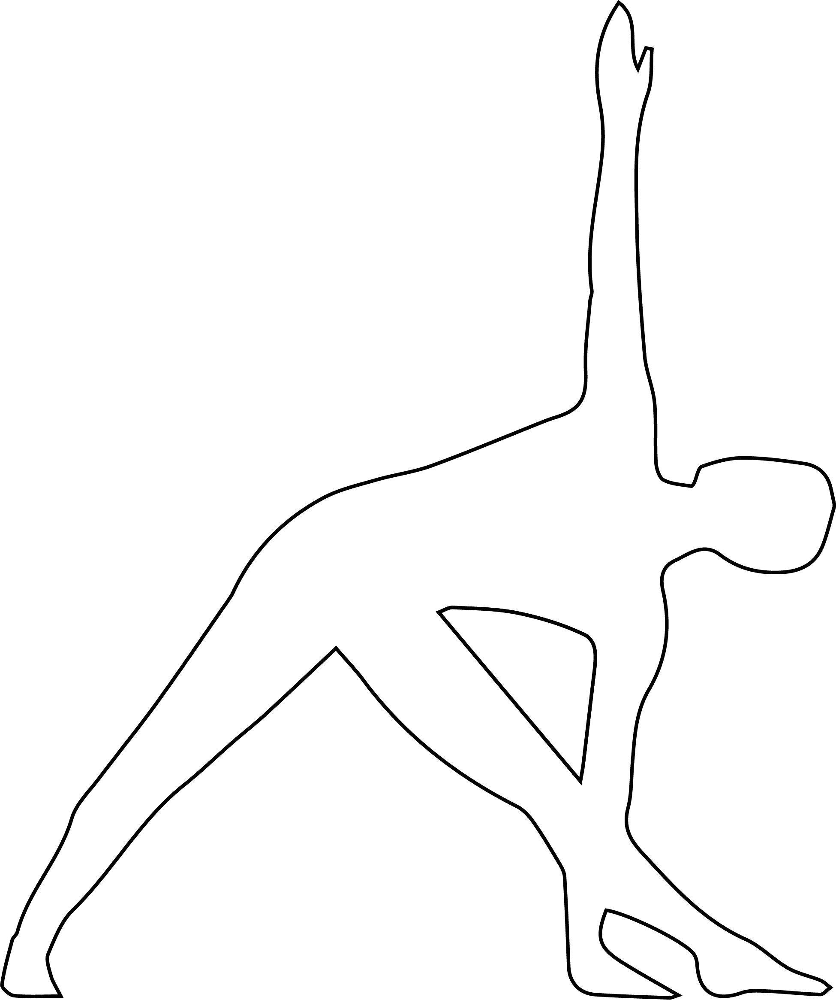

# Utthita Trikonasana

[TOC]

**Trikonasana** or Triangle Pose is an asana. Variations include utthita trikonasana, baddha trikonasana and parivrtta trikonasana.

## Technique
1. Stand erect. Now, keep distance between your legs about 3 to 4 feet
1. Extend your arms at the shoulder level.
1. Inhale and raises your right arm by the side of your head.
1. Now, bend your right arms with exhaling towards the left side by keeping your body weight equally on both the feet. You should ensure that the right arm become parallel to the ground.
1. Maintain the position as per your comfort with normal breathing and come to the original position by inhaling.
1. Do the same procedure with the left arm.
1. Perform three to five rounds of trikonasana.

## Effects
* Helps in Stretches hips, back muscles, chest and shoulders.
* Stretches the spine.
* Give Strength to the thighs, calves and buttocks.
* Stimulates the spinal nerves.
* It improves the flexibility of the spine, correct alignment of shoulders.
* It relieves from backache, gastritis, indigestion, acidity, flatulence, Assists treatment of neck sprains, reduces stiffness in the neck, shoulders and knees, strengthens the ankles and tones the ligaments of the arms and legs.
* It also stimulates the nervous system and alleviates nervous depression, strengthens the pelvic area and tones the reproductive organs.

## Related Asanas
* [Tadasana](../yoga/Tadasana.md)
* [Vriksasana](../yoga/Vriksasana.md)

## Special requisites
These are a few things you should keep in mind before you practice this asana:

* If you suffer from neck problems, do not look upward. Just continue looking straight, and make sure both sides of your neck are evenly elongated.
* If you suffer from high blood pressure, look downwards instead of looking upwards.

## Initial practice notes
As a beginner, it might be a good idea to lock the back of your heel or the back of your torso against the wall to keep steady in the pose.

## References

## External Links
* [Trikonasana on eyogaguru.com](https://eyogaguru.com/trikonasana-triangle-pose-benefits/)
* [Trikonasana on sarvyoga.com](https://www.sarvyoga.com/trikonasana-triangle-pose-steps-and-benefits/)
* [Trikonasana on sarvyoga.com](https://www.doyouyoga.com/holistic-benefits-of-trikonasana-65196/)

## References

1. ["Methodology"](http://www.gyanunlimited.com/health/triangle-pose-yoga-trikonasana-benefits-for-weight-loss-obesity/9039/)
2. [tips"]("Beginers)(http://www.stylecraze.com/articles/trikonasana-benefits/#BeginnersTips)
3. [benefits"]("Health)(https://www.sarvyoga.com/trikonasana-triangle-pose-steps-and-benefits/)
