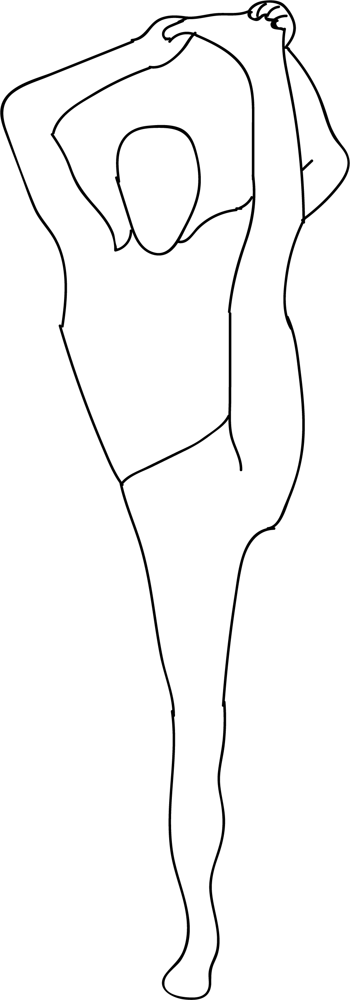

# Utthita Trivikramasana

[TOC]

**Utthita Trivikramasana**  is an Asana. It is translated as ***Extended Pose Dedicated to Trivikrama*** from **Sanskrit**.

The name of this pose comes from "utthita" meaning "extended", "Trivikrama" in reference to a Hindu Mythology Trivikrama, and "asana" meaning "posture" or "seat". This pose is a variation of Trivikramasana.

## Benefits
1. It stretched the side of the body
1. Promotes spinal flexibility and balance.

## Cautions
* Be careful while doing this pose if you have any spinal injuries.

## References

## References

1. ["wikipedia"](https://en.wikipedia.org/wiki/Utthita_Trivikramasana)
