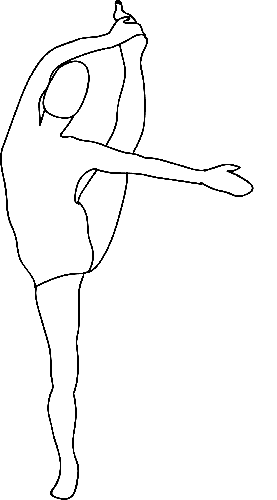

# Utthita hasta padangusthasana

[TOC]

**Utthita Hasta Padangustasana** is an Asana. It is translated as Extended Hand to Big Toe Pose from Sanskrit. the name of this pose comes from **utthita** meaning **extended**, **hasta** meaning **hand**, **pada** meaning **leg** or **foot**, **angusta** meaning **big toe**, and **asana** meaning **posture** or **seat**.

## Technique
1. First get into the position of Tadasana, keep your left knee in the direction of your belly.
1. Now reach your left arm inward to your thigh and cross it over your front ankle. After doing this you have to hold the outside of your left foot (If you have tight hamstrings then hold a strap loop around your left sole).
1. Keep your front thigh muscles of your standing leg strong along with keeping your outer thigh in an inward direction.
1. Breathe in and expand your left leg forward.
1. Now, you have to straighten your knee as much as you can. After that swing your left leg out to the side. Breathe normally and try to maintain your balance. Breathing helps you to balance.
1. Remain in the pose around 30 seconds; breath out and down your leg to the floor. Repeat the same process with your alternate leg.

## Technique in pictures/animation
## Effects
* Improves our sense of groundedness and security in the universe.
* Stretches the hamstrings and adductor muscles of the lifted leg.
* Improves balance and strengthens the nervous system.
* Develops strength and proprioception in the muscles of the core.

## Related Asanas
* [Supta Padangusthasana](../yoga/Supta_Padangusthasana.md)
* [Supta Virasana](../yoga/Supta_Virasana.md)
* [Uttanasana](../yoga/Uttanasana.md)

## Special requisites
* Pain in the legs, ankles or feet.
* Pain or instability in the hips.
* Balance issues or vertigo.

## Initial practice notes
You can hold this pose longer by supporting the raised-leg foot on the top edge of a chair back (padded with a blanket). Set the chair an inch or two from a wall and press your raised heel firmly to the wall.

## References

## External Links
* [Utthita hasta padangusthasana on spotebi.com](https://www.spotebi.com/exercise-guide/extended-hand-to-big-toe-pose/)
* [Utthita hasta padangusthasana on gaia.com/](https://www.gaia.com/article/extended-hand-toe-pose-utthita-hasta-padangusthasana)
* [Utthita hasta padangusthasana on befityoga.com](https://www.befityoga.com/2011/08/utthita-hasta-padangusthasana/)

## References

1. ["Methodology"](https://www.sarvyoga.com/extended-hand-to-big-toe-pose-utthita-hasta-padangusthasana/)
2. [tips"]("Beginers)(http://harmonyyoga.com/the-benefits-of-utthita-hasta-padangustasana)
3. [benefits"]("Health)(http://www.feelgoodyogavictoria.com/learning-centre/yoga/extended-hand-big-toe-utthita-hasta-padangusthasana-pose/)
