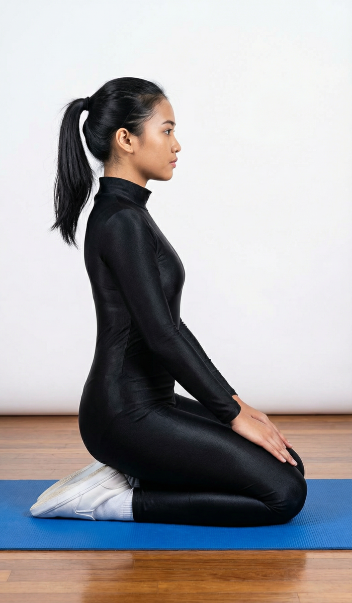

# Vajrasana

[TOC]

This yoga posture has been named after the shape it takes – that of a diamond or thunderbolt. One can sit in Vajrasana (Adamintine Pose) at the time of doing pranayamas. This yoga posture is pronounced as vahj-RAH-sah-na.

## Technique
* Kneel down with lower legs stretched straight backwards and toes crossing each other.
* Sit over the heels – your buttocks should sit on the heels and thighs on the calf muscles.
* Sit straight with head facing forward and hands on your knees.
* Close your eyes (optional) and focus on breath observing inhalation and exhalation.
* Practice this position for 5 – 10 minutes in initial days and increase gradually up to 20 – 30 minutes.

## Technique in pictures/animation
## Effects
* Enhances blood circulation in the lower abdomen improving digestion.
* If you sit in Vajrasana after food, food gets digested well.
* Relieves excessive gas trouble or pain.
* Nerves of legs and thighs are strengthened.
* Makes knee and ankle joints flexible and prevents certain rheumatic diseases.
* In Vajrasana, the spine is erect without much effort. It is also beneficial for practice of pranayam and as a preparatory for meditation.

## Related Asanas
* [Ardha Shalabhasana](Ardha_Shalabhasana.md)
* [Shalabhasana](Shalabhasana.md)

## Special requisites
* It is best to avoid this asana if you have a knee problem or have undergone surgery in your knees recently.
* Pregnant women should keep their knees slightly apart when they practice this asana so that they avoid putting pressure on their abdomen.

## Initial practice notes
As a beginner, when you assume this position, it is likely that your legs might begin to pain in no time. If this happens, all you need to do is undo the asana, and stretch your legs forward.

## References

## External Links
* [Vajrasana on food.ndtv.com](https://food.ndtv.com/health/benefits-of-vajrasana-one-pose-to-solve-all-your-tummy-troubles-1407071)
* [Vajrasana on healthnbodytips.org](https://healthnbodytips.org/benefits-of-vajrasana-pose-yoga-how-to-do-vajrasana.html/)
* [Vajrasana on wellnessdose.com](http://wellnessdose.com/vajrasana-and-its-12-health-benefits-2/)
* [Vajrasana on 7pranayama.com](https://7pranayama.com/vajrasana-adamintine-pose-steps-benfits/)

## References

1. ["Methodology"](https://vishwashantiyoga.com/vajrasana-for-weight-loss.html)
2. [tips"]("Beginers)(http://www.stylecraze.com/articles/how-to-do-the-vajrasana-and-what-are-its-benefits/#Beginner'sTips)
3. [benefits"]("Health)(https://www.artofliving.org/in-en/yoga/yoga-poses/vajrasna-adamintine-pose)
