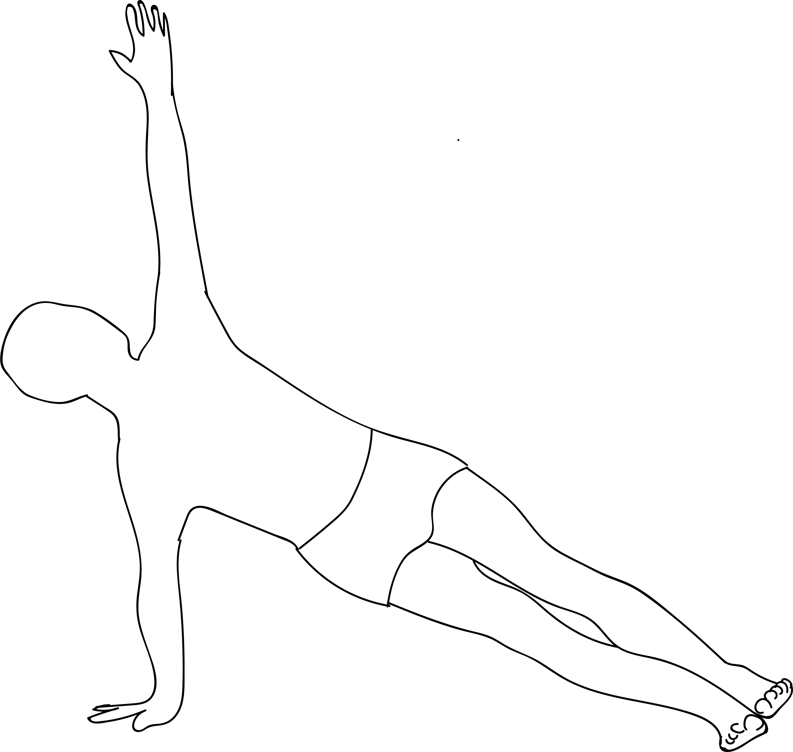

# Vasisthasana

[TOC]

**Vasisthasana** is an Asana. It is translated as Pose Dedicated to Sage Vasistha from Sanskrit. The name of this pose comes from **Vasistha** meaning **excellent** or **the richest** or **best**, and **asana** meaning **posture** or **seat**. Vasistha is a name of a Sage.

## Technique
1. Get into the Adho Mukha Svanasana or Downward Facing Dog Pose. Place your right foot on top of your left foot. Place your hand on your hip and turn your body accordingly. You will now be supporting the weight of your body on your foot and hand on the left.
1. Place the hand that supports your body a little ahead of your shoulders so that it is done in a slight angle from the floor. Keep your arm straight with the palm pressed firmly on the ground.
1. Now tighten your thighs and apply weight on the floor through the heels of your legs. Your whole body is now in a diagonal alignment with the floor.
1. You can also raise your right hand upward and remain in this balanced position for a while.
1. Return to the Downward Facing Dog pose again and perform the same exercise on your right side.
1. When complete, move into the Balasana (Child Pose).

## Technique in pictures/animation
## Effects
* Strengthens the arms, belly, and legs
* Stretches and strengthens the wrists
* Stretches the backs of the legs (in the full version described below)
* Improves sense of balance

## Related Asanas
* [Adho Mukha Svanasana](../yoga/Adho_Mukha_Svanasana.md)
* [Ardha Chandrasana](../yoga/Ardha_Chandrasana.md)
* [Plank Pose](Plank_Pose.md)

## Special requisites
* If you have a severe elbow, wrist, or shoulder injury, you must avoid this pose.

## Initial practice notes
* Keep the lower knee. This will give you the support you need to build strength in your core and arms.
* Do not stack your feet over each other. Place them slightly apart, such that the outer edge of the right and the inner edge of the left foot are on the floor.

## References

## External Links
* [Vasisthasana on mobiefit.com](https://www.mobiefit.com/blog/yoga-diaries-steps-variations-and-benefits-of-vasisthasana-or-side-plank-pose/)
* [Vasisthasana on yogicwayoflife.com](http://www.yogicwayoflife.com/vasisthasana-side-plank-pose/)
* [Vasisthasana on lifenlesson.com](https://lifenlesson.com/plank-pose-benefits-vasisthasana/)

## References

1. ["Methodology"](http://www.yogawiz.com/yoga-poses/side-plank-pose.html)
2. [tips"]("Beginers)(http://www.stylecraze.com/articles/vasisthasanaside-plank-pose/#Beginner’sTip)
3. [benefits"]("Health)(https://www.yogajournal.com/poses/side-plank-pose)
