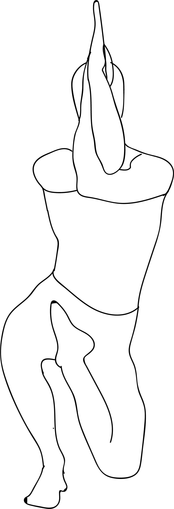

# Vatayanasana

[TOC]

**Vatayanasana** is an Asana. It is translated as Horse Pose from Sanskrit. The name of this pose comes from **vatayana** meaning **horse**, and **asana** meaning **posture** or **seat**.

## Technique
1. Stand up straight and bend the right leg upwards at the knee so that the heel of your right foot is touching your groin and the toes are placed along the base of your left thigh.
1. Now bend your left knee so as to lower your body till the folded right knee is resting on the ground.
1. You are now standing on your left foot and right knee.
1. Raise both your arms and bend your elbows so that your forearms are pointing upwards.
1. Keep your left elbow in the crook of your right elbow and entwine your right forearm around your lower left arm.
1. The palms of your hands should be together in the namaskar position.
1. Hold this pose for 30 to 60 seconds and then return to your normal position.
1. Repeat the pose for the opposite side, standing on your right foot and left knee.
1. This completes one set. Repeat the set twice.

## Technique in pictures/animation
## Effects
* Removes stiffness in the sacroiliac joint.
* Reduces stiffness and pain associated with arthritis.
* Helpful in cases of inguinal and femoral hernia.
* Reduces cramping in the thigh region.

## Related Asanas
* [Garudasana](../yoga/Garudasana.md)
* [Ardha Baddha Padmottanasana](../yoga/Ardha_Baddha_Padmottanasana.md)

## Special requisites
While performing this pose, you are supposed to take numerous precautions. As this pose is considered as an intermediate level pose, it is difficult for the beginner's to perform it.

## Initial practice notes
It is advisable for the beginner's not to perform this kind of difficult poses alone. You can take the help of the partner in order to complete the pose successfully. Remember that your hips need a certain amount of litheness.

## References

## External Links
* [Vatayanasana on stylesatlife.com](http://stylesatlife.com/articles/vatayanasana/)
* [Vatayanasana on yogapedia.com](https://www.yogapedia.com/definition/7191/vatayanasana)
* [Vatayanasana on completenaturecure.com](https://www.completenaturecure.com/horse-pose-yoga-posevatayanasana/)

## References

1. ["Methodology"](http://www.yogawiz.com/yoga-poses/horse-pose.html)
2. [tips"]("Beginers)(http://www.astrolika.com/yoga/vatayanasana.html)
3. [benefits"]("Health)(http://www.yogawiz.com/yoga-poses/horse-pose.html)
