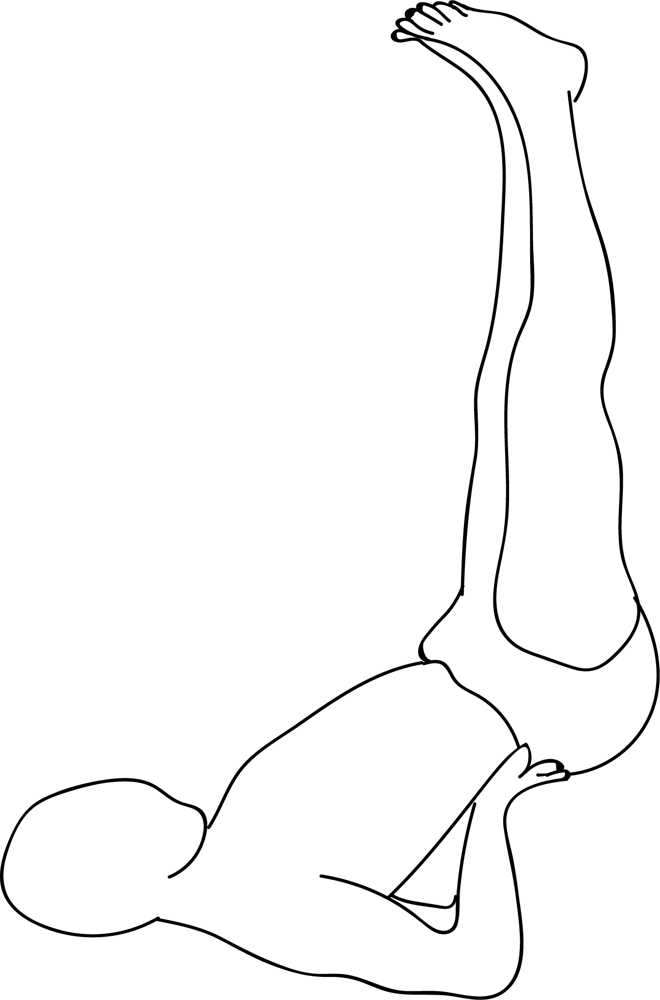

# Viparita Karani

[TOC]

**Viparita Karani** is a restorative pose similar to Sarvangasana. It gives relaxation to the abdomen, legs and the lower back, especially after standing asanas.

## Technique
1. Find an open space near a wall and sit next to it, such that your feet are on the floor, spread in front of you, and the left side of your body is touching the wall.
1. Exhale. Lie on your back, making sure that the back of your legs press against the wall, and that the soles of your feet face upwards. It will take you a little bit of movement to get comfortable in this position.
1. Place your buttocks a little away from the wall or press them against the wall.
1. Make sure your back and head are resting on the floor. You will find that your body forms a 90-degree angle.
1. Lift your hips up and slide a prop under them. You could also use your hands to support your hips and form that curve in your lower body.
1. Keep your head and neck in a neutral position and soften your throat and your face.
1. Close your eyes and breathe. Hold the position for at least five minutes. Release and roll to any one side. Breathe before you sit up.

## Technique in pictures/animation
## Effects
* This also activates the spiritual center in the neck region called the vishuddhi chakra which is closely associated with the thyroid glands and general health.
* The inverted pose relieves the gravitational weight from many organs and helps in piles, hydrocele and certain kinds of hernia.
* It tones the spine, the neck, the intestines and other organs in the abdomen.
* It can help to reduce fat around the waist region.
* Vipareeta karani asana is used in kriya yoga as a one of the poses for performing spinal breathing.

## Related Asanas
* [Uttanasana](../yoga/Uttanasana.md)
* [Virasana](../yoga/Virasana.md)

## Special requisites
* This asana is a mild inversion, and therefore, it must be avoided during menstruation.
* Avoid this asana if you have severe eye problems like glaucoma.

## Initial practice notes
As a beginner, you might find it hard to get the alignment right in this pose. For this, you must breathe such that the heads of your thigh bones are firmly pressed against the wall.

## References

## External Links
* [Viparita Karani on yogajournal.com](https://www.yogajournal.com/practice/legs-up-the-wall-pose)
* [Viparita Karani on doyouyoga.com](https://www.doyouyoga.com/6-benefits-of-legs-up-the-wall-pose-48440/)
* [Viparita Karani on planetayurveda.com](http://www.planetayurveda.com/library/viparita-karani-legs-up-the-wall-pose/)
* [viparita karani 7pranayama.com](https://7pranayama.com/vipritkarani-asana-yoga-legsup-thewall-steps-benefits/)

## References

1. ["Methodology"](http://www.stylecraze.com/articles/viparita-karani-legs-up-the-wall-pose/#HowToDoTheViparitaKarani)
2. [tips"]("Beginers)(http://www.stylecraze.com/articles/viparita-karani-legs-up-the-wall-pose/#Beginner’sTip)
3. [benefits"]("Health)(http://www.yogicwayoflife.com/vipareeta-karani-asana-inverted-pose/)
