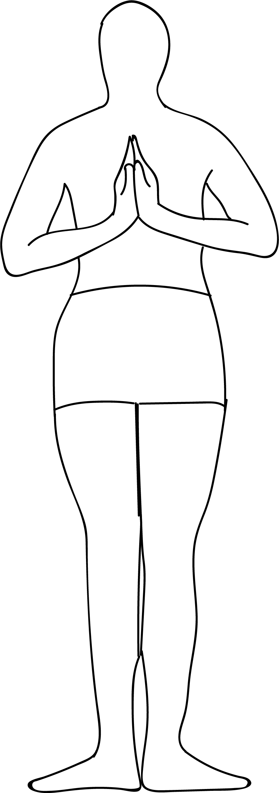

# Viparita Namaskar Tadasana

[TOC]

**Viparita Namaskar Tadasana** is an Asana. It is translated as  **Reverse Prayer Mountain Pose** from **Sanskrit**. The name of this pose comes from **viparita** meaning **reversed**, **namaskar** meaning **hands in prayer salutation**, **tada** meaning **mountain**, and **asana** meaning **posture** or **seat**. This pose is a variation of Tadasana.

## Technique
1. First get into the standing position on the floor or yoga mat with your legs together and keep one-inch distance between your feet.
1. Keep your hands hang by the sides of your legs and relax your shoulders (same as Tadasana starting pose).
1. After that bend your knees a little. Now lift your hands parallel to your shoulders.
1. Place your hands behind your back and keep your finger pointing downwards (At that point don’t join your palms).
1. Breathe in, and turn your fingertips inward towards your spine and try to join your palms together and turn your fingertips upwards (Namaskar pose).
1. Keep your knees little bit bent and your palms should be pressed strongly against each other. At this point, close your eyes and focus your mind on the word Om.
1. Hold the position about 25 to 35 seconds.
1. Then, slowly turn down your fingertips, discharge your palms and gently take down your hands to the sides of your legs. Take some rest and repeat the process around 3 to 5 times.
1. You have now returned to Tadasana.

## Technique in pictures/animation
## Effects
* Opens the abdomen, thus allowing deeper breaths.
* Stretches the upper back.
* Stretches the shoulder joints and pectoral muscles.

## Related Asanas
* [Tadasana](../yoga/Tadasana.md)

## Special requisites
People with low blood pressure, arm or shoulder injury should avoid doing this pose.

## Initial practice notes
## References

## External Links
* [Viparita Namaskar Tadasana on yogapedia.com](https://www.yogapedia.com/definition/8069/tadasana-paschima-namaskar)
* [Viparita Namaskar Tadasana on stylecraze.com](http://www.stylecraze.com/articles/what-is-reverse-prayer-yoga-and-its-benefits/#gref)
* [Viparita Namaskar Tadasana on cnyhealingarts.com](http://www.cnyhealingarts.com/2015/04/13/the-health-benefits-of-tadasana-mountain-pose/)

## References

1. ["Methodology"](https://www.sarvyoga.com/reverse-prayer-pose-viparita-namaskarasana/)
2. [benefits"]("Health)(https://www.artofliving.org/in-en/yoga/yoga-poses/reverse-prayer-pose)
