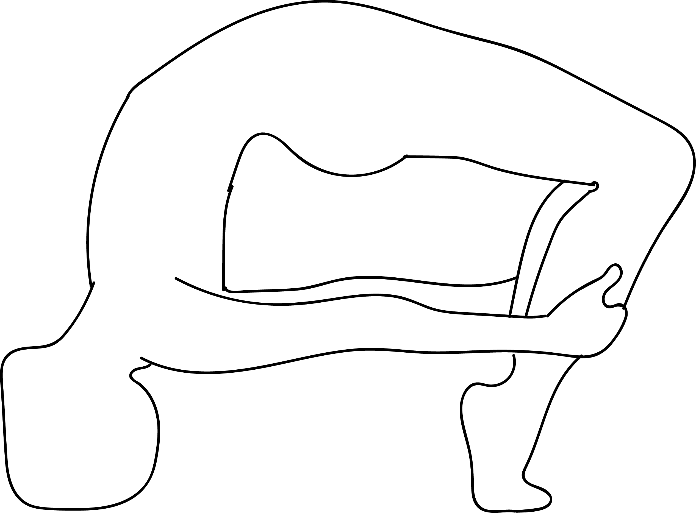

# Viparita Prapada Dhanurasana

[TOC]

**Viparita Prapada Dhanurasana** is an Asana. It is translated as **Inverted Tiptoe Bow Pose** from **Sanskrit**. The name of this pose comes from **viparita** meaning **inverted**, **prapada** meaning **tips of toes**, **dhanu** meaning **bow**, and **asana** meaning **posture** or **seat**.

## Technique
1. Lie flat on your back. Keep your feet together and hands by the side of your hips.
1. Fold your knees and bring your heels closer to your sitting bones. Place your heels flat on the floor. Keep some distance between your heels.
1. Bend your elbows and press your palms on the floor. Make sure your palms are comfortably placed next to your head and your fingers are pointing toward your shoulders. The distance between your palms should be the same as the distance between your feet.
1. Press your feet and palms against the floor. Exhale and gradually lift your hips off the floor. Let your arms and legs support your body weight equally.
1. Push with your arms and legs to bring the crown of your head upon the floor.
1. Press your feet and palms into the floor, lift your head off the floor and straighten your arms as much as possible.
1. Lengthen your spine and try to turn your head to face the ground.
1. Distribute your weight equally and extend your arms and legs.
1. Slowly bring the crown of your head upon the floor.
1. Bend your elbows and place your forearms on the floor (palms facing the floor).
1. Inhale and push your chest slightly forward.
1. Lift your heels off the floor and slowly grip your right ankle with your right hand. Hold this pose for a few seconds and then grip your left ankle with your left hand.
1. Stay in this pose for 3 to 6 long breaths.

## Technique in pictures/animation
## Effects
* Relieves stress, anxiety, depression and fatigue.
* Energizes the whole body.
* Stimulates the thyroid and pituitary glands.
* Slows down ageing.
* Stretches the spine, chest and lungs.
* Increases flexibility.

## Related Asanas
* [Adho Mukha Svanasana](../yoga/Adho_Mukha_Svanasana.md)

## Special requisites
* Anyone suffering from severe back, neck or head injuries.
* Anyone with carpal tunnel syndrome, heart problems, high or low blood pressure, diarrhea.
* Avoid during pregnancy.

## Initial practice notes
## References

## External Links
* [Viparita Prapada Dhanurasana on ipfs.io](https://ipfs.io/ipfs/QmXoypizjW3WknFiJnKLwHCnL72vedxjQkDDP1mXWo6uco/wiki/Viparita_Prapada_Dhanurasana.html)
* [Viparita Prapada Dhanurasana on arogyayogaschool.com](https://arogyayogaschool.com/blog/15-health-benefits-of-bow-pose-yoga-dhanurasana/)
* [Viparita Prapada Dhanurasana on ayurvedagram.com](https://www.ayurvedagram.com/dhanurasana-bow-pose/)

## References

1. ["Methodology"](https://365dayspact.wordpress.com/2017/06/03/viparita-prapada-dhanurasana-inverted-tip-toe-bow-pose-push-past-your-limits/)
2. [benefits"]("Health)(https://ipfs.io/ipfs/QmXoypizjW3WknFiJnKLwHCnL72vedxjQkDDP1mXWo6uco/wiki/Viparita_Prapada_Dhanurasana.html)
