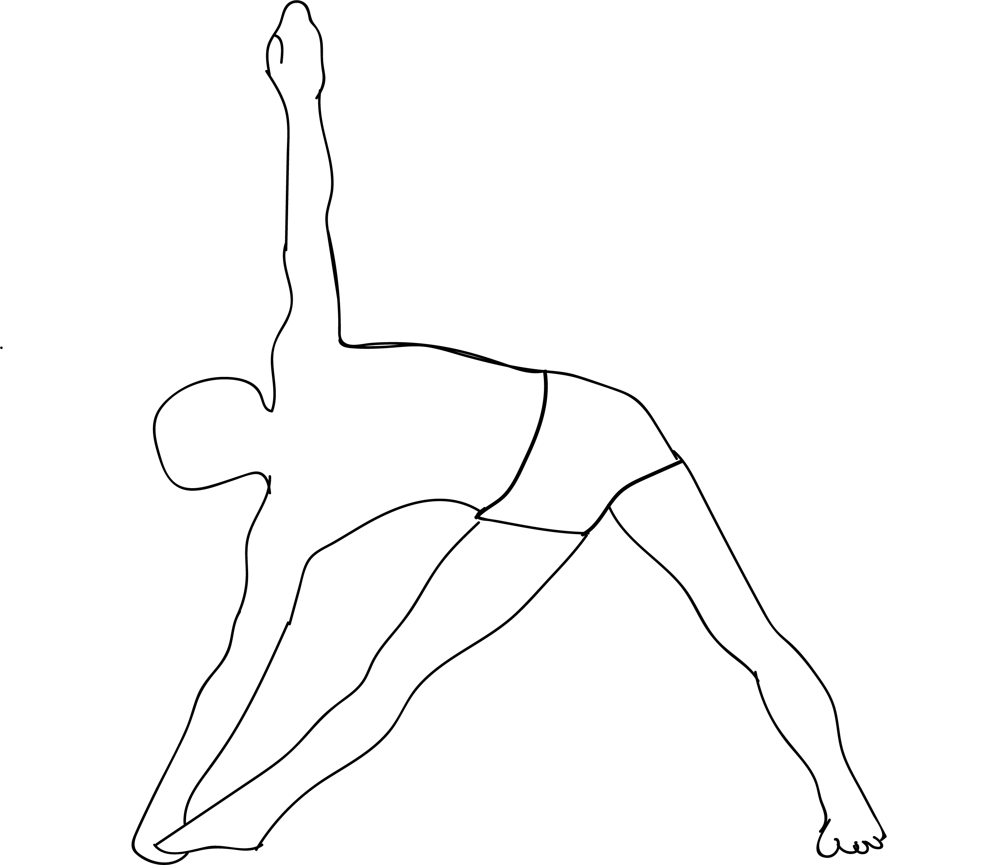

# Viparita Virabhadrasana

[TOC]

**Viparita Virabhadrasana** is an Asana. It is translated as Reversed Warrior Pose from Sanskrit. The name of this pose comes from **viparita** meaning **reversed**, **virabhadra** meaning **legendary warrior**, and **asana** meaning **posture** or **seat**.

## Technique
1. Begin in Mountain Pose, standing with feet hip-distance apart and arms at the sides. Turn to the left and step both feet wide apart, about 4-5 feet. Align the heels.
1. Turn the right foot out 90 degrees, so the toes are pointing to the top of the mat.  Pivot the left foot slightly inwards. The back toes should be at a 45-degree angle.
1. Raise the arms to the side to shoulder-height, parallel to the floor. The arms should be aligned directly over the legs. With palms facing down, reach actively from fingertip to fingertip.
1. Exhale while bending the front knee. Align the knee directly over the ankle of the front foot.  Take care that the front shin is perpendicular to the floor. Sink the hips low, eventually bringing the front thigh parallel to the floor. This is Warrior II.
1. With the next exhale, drop the left (back) hand to the back of the left thigh. With the next inhale, lift the right arm straight up, reaching the fingertips toward the ceiling. The right bicep should be next to the right ear.
1. Keep the front knee bent and the hips sinking low while lengthening through the sides of the waist. Slide the back hand further down the leg and come into a slight backbend.
1. Tilt the head slightly and gaze to the right hand’s fingertips.
1. Keep the shoulders relaxed, chest lifted and the sides of the waist long, hold for 10-20 breaths.

## Technique in pictures/animation
## Effects
* Reverse Warrior stretches the side of the torso and arm.
* opens the hips and builds lower body strength.

## Related Asanas
* [Virabhadrasana](Virabhadrasana.md)

## Special requisites
* Recent or chronic injury to the hips, back or shoulders.

## Initial practice notes
## References

## External Links
* [Viparita Virabhadrasana on wellbeingmantras.com](http://wellbeingmantras.com/benefits-of-reverse-warrior-pose-or-viparita-virabhadrasana/)
* [Viparita Virabhadrasana on yogaoutlet.com](https://www.yogaoutlet.com/guides/how-to-do-reverse-warrior-pose-in-yoga)
* [Viparita Virabhadrasana on ekhartyoga.com](https://www.ekhartyoga.com/more-yoga/yoga-poses/reverse-warrior-pose)

## References

1. ["Methodology"](https://wilmingtonyogacenter.com/pose-of-the-week-viparita-virabhadrasana-reverse-warrior/)
2. [benefits"]("Health)(http://www.yogabasics.com/asana/reverse-warrior/)
