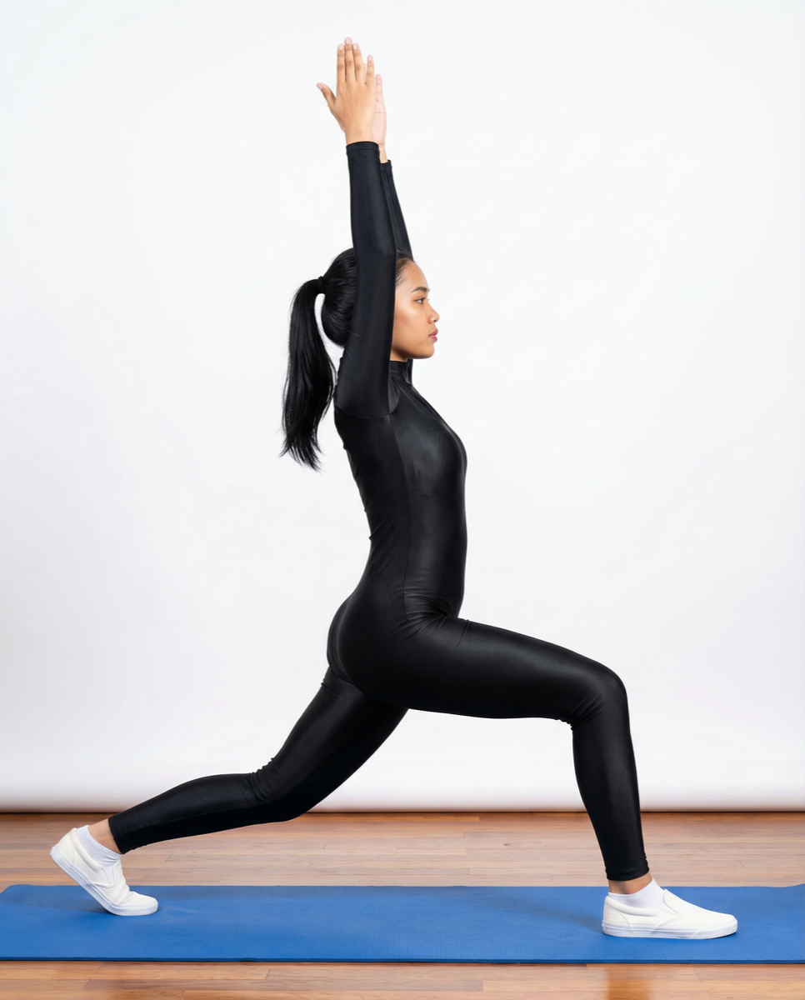

# Virabhadrasana I

[TOC]

**Warrior I** or **Virabhadrasana I** is a standing yoga pose named after a mythological Hindu warrior, Virabhadra. An incarnation of the god Shiva, Virabhadra was fierce and powerful, with a thousand arms and hair and eyes of fire.

## Technique
1. Take a deep breath and step your legs 4-5 feet apart, raise your arms upwards to join both the palms right over your head.
1. Exhale and turn the right foot outwards 90 degree to the right, slightly turn the left foot inwards 45-60 degree to the right.
1. The right heel must be aligned with the arch of the left heel, rotate the torso to the right keeping the arms straight.
1. Exhale and bend the right knee until the right thigh becomes parallel to the floor, keep the right shin perpendicular to the floor.
1. This alignment will form a 90-degree angle between your right thigh and right shin, the bent knee must not extend beyond the ankle. It must be aligned right over the heel.
1. Left leg must remain stretched out and tighten at the knee throughout the practice, move your face in the upward direction and look at the joined palms.
1. Retain the final position from a few seconds to half a minute.Take long and deep breaths. to release the posture reverse the movements one by one in the same manner.
1. Repeat the steps on the left side for the same duration as right.

## Effects
* Strengthens your shoulders, arms, legs, ankles and back
* Opens yours hips, chest and lungs
* Improves focus, balance and stability
* Encourages good circulation and respiration
* Stretches your arms, legs, shoulders, neck, belly, groins and ankles
* Energizes the entire body

## Related Asanas
* [Supta Virasana](../yoga/Supta_Virasana.md)
* [Upavistha Konasana](../yoga/Upavistha_Konasana.md)
* [Adho Mukha Svanasana](../yoga/Adho_Mukha_Svanasana.md)
* [Utthita Parsvakonasana](../yoga/Utthita_Parsvakonasana.md)

## Special requisites
* It is important to consult a doctor before you practice this asana, especially if you have spinal problems or have just recovered from a chronic illness.
* If you have shoulder pains, raise your arms and leave them parallel to each other instead of holding them above your head.

## Initial practice notes
Usually, when the front knee is bent into the pose, beginners tend to tip their pelvis forward.

## References

## External Links
* [Virabhadrasana I on yogajournal.com](https://www.yogajournal.com/poses/warrior-i-pose)
* [Virabhadrasana I on arogyayogaschool.com](https://arogyayogaschool.com/blog/warrior-pose-virabhadrasana/)
* [Virabhadrasana I on artofliving.org](https://www.artofliving.org/yoga/yoga-poses/warrior-pose-virbhadrasana)
* [Virabhadrasana I on 7pranayama.com](http://7pranayama.com/warrior-pose-steps-virabhadrasana-yoga-benefits/)

## References

1. ["Methodology"](http://www.finessyoga.com/yoga-asanas/virabhadrasana-warrior-pose-steps-benefits)
2. [tips"]("Beginers)(http://www.stylecraze.com/articles/virabhadrasana-benefits/#BeginnersTips)
3. [benefits"]("Health)(http://www.cnyhealingarts.com/2011/05/20/the-health-benefits-of-virabhadrasana-i-warrior-i-pose/)
