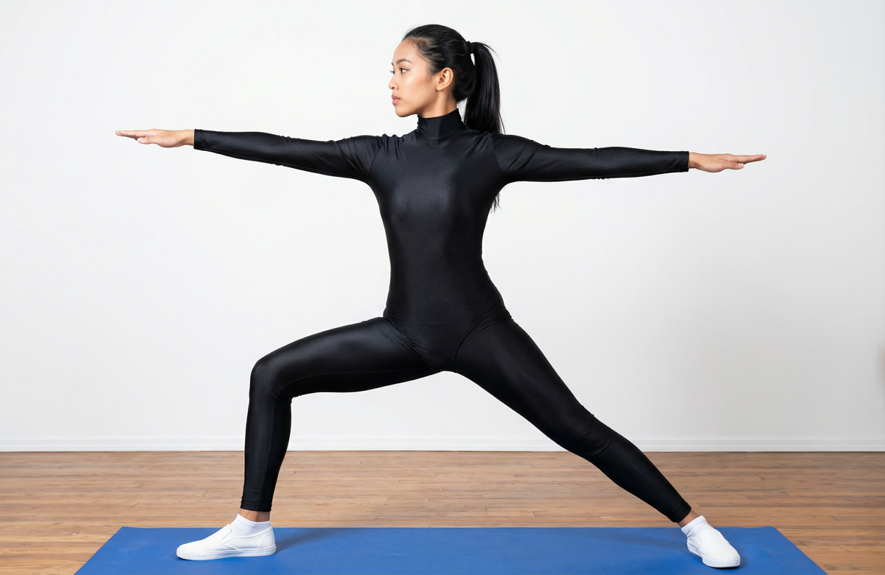

# Virabhadrasana II

[TOC]

This pose looks like a soldier in the position of war so it is Called as **Virabhadrasana (Warrior Pose)**. Virabhadrasana 2 or Warrior 2 yoga pose is one of the effective yoga poses to strengthen arms, legs and abdomen area.

## Technique
1. Stand straight with your legs by keeping distance 3-4 feet between each other.
1. Inhale and raise both hands parallel to the ground and turn your head to the right.
1. While exhaling slowly turn your right foot at 90 degrees to the right.
1. Slowly bend your right knee. Keep in mind that right thigh should be parallel to the ground. Stay in this position for some time. Breathe deeply for 4 times.
1. After this come to your original standing position breathe normally. And perform the same steps for left leg by turning head to left.
1. Repeat this cycle for 4-5 times.

## Effects
* Stretches your hips, groins and shoulders
* Opens your chest and lungs
* Builds stamina and concentration
* Energizes tired limbs
* Stimulates your abdominal organs
* Helps relieve backaches, especially through your 2nd trimester
* Develops balance and stability
* Improves circulation and respiration
* Therapeutic for flat fleet, sciatica, osteoporosis, carpal tunnel and infertility

## Related Asanas
* [Baddha Konasana](Baddha_Konasana.md)
* [Supta Padangusthasana](../yoga/Supta_Padangusthasana.md)
* [Utthita Trikonasana](../yoga/Utthita_Trikonasana.md)
* [Vrikshasana](Vrikshasana.md)

## Special requisites
These are a few things you must be cautioned about when you do the Virabhadrasana.

* It is best to practice the Warrior Pose II under the supervision of a certified yoga instructor or after consulting your doctor, especially if you have had any spinal disorders in the past or if you have just recovered from a chronic illness.
* People suffering from high blood pressure should completely avoid practicing this posture.

## Initial practice notes
Here is a little tip for beginners. When you bend the left knee to a right angle as you get into the pose, bend it quickly with a deep exhalation, and aim to place the inside of the left knee towards the little-toe side of the left foot.

## References

## External Links
* [Virabhadrasana II on yogajournal.com](https://www.yogajournal.com/poses/warrior-ii-pose)
* [Virabhadrasana II on harmonyyoga.com](http://harmonyyoga.com/the-benefits-of-warrior-ii)
* [Virabhadrasana II on findhealthtips.com](http://www.findhealthtips.com/the-health-benefits-of-virabhadrasana-ii-warrior-ii-pose/)

## References

1. ["Methodology"](https://eyogaguru.com/warrior-2-yoga-pose-steps-and-benefits/)
2. [tips"]("Beginers)(http://www.stylecraze.com/articles/veerabhadrasana-benefits/#BeginnersTips)
3. [benefits"]("Health)(http://www.cnyhealingarts.com/2011/06/01/the-health-benefits-of-virabhadrasana-ii-warrior-ii-pose/)
