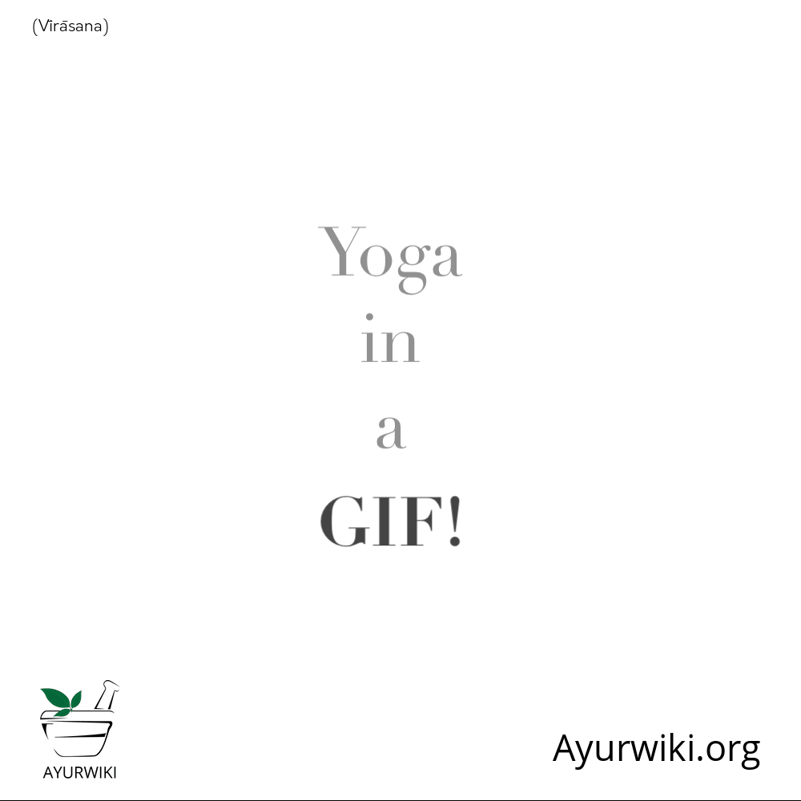
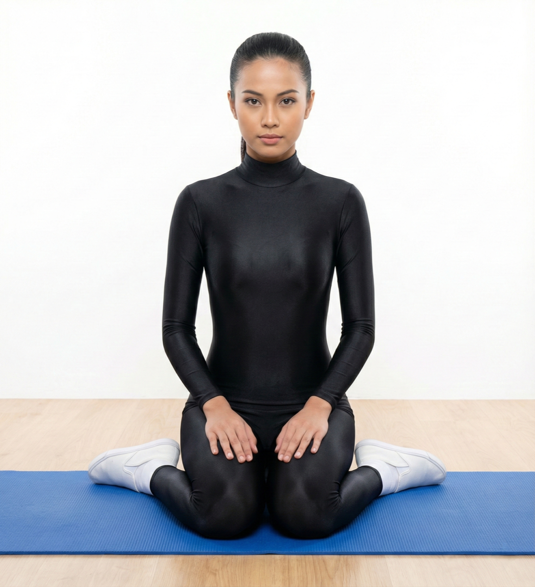

# Virasana

[TOC]

**Virasana** creates the deepest flexion of the knee joint possible (to a healthy, normal knee) and thus **resets** and re-stabilizes this important joint. And while it is an excellent posture to keep your knees healthy and mobile, it should be noted that it is contraindicated for practitioners with existing knee and/or ankle injuries.

## Technique
1. First kneel down, at that point parallel your hip girth separately.
1. Transfer a little in way over hip girth along with your higher than level on the ground.virasana steps
1. Bend forward and twist the plump a part of calves external with the hands.
1. Sit on the ground among the feet and breathe out. (During practice if you’re feeling any distress or not able to sit properly on the ground, in that case try to sit properly).
1. Place your hands on top of thighs just near to knees, your palms should facing down.
1. Now relax your upper body and shoulders, your spine should be straight and tall.
1. The crown of your head should point to the ceiling and looks straight ahead.
1. During the process assume that you are hero or warrior, who sits tall and proud.
1. Hold this pose for thirty seconds to one minute.
1. During the process take normal breathing.
1. After that relieve your feet, ankles and knees that time shake your legs.

## Technique in pictures/animation
## Effects
* Stretches the hips, thighs, knees, ankles and feet
* Improves circulation and relieves tired legs
* Strengthens foot arches, relieving flat feet
* Improves digestion and relieves gas
* Helps relieve the symptoms of menopause
* Improves posture
* Reduces swelling of the legs during pregnancy (through second trimester)
* Therapeutic for asthma and high blood pressure

## Related Asanas
* [Baddha Koṇāsana](Baddha_Koṇāsana.md)
* [Bālāsana](Bālāsana.md)

## Special requisites
* Avoid this asana if you have heart problems.
* If you have a headache, lie on a bolster when you practice this asana.
* Avoid this asana if you have a knee injury, unless you are practicing it under the supervision of a certified yoga instructor.

## Initial practice notes
As a beginner, you might find it difficult to balance the pressure of the top of your feet on the floor.

This is one of the Asanas prescribed in [Hatha Yoga Pradipika](Hatha_Yoga_Pradipika_(book).md).

## References

## External Links
* [on arogyayogaschool.com](https://arogyayogaschool.com/blog/health-benefits-hero-pose-virasana/Virasana)
* [Virasana on easyayurveda.com](https://easyayurveda.com/2018/01/17/virasana-hero-pose/)
* [Virasana on doyouyoga.com](https://www.doyouyoga.com/the-holistic-benefits-of-hero-pose-24072/)

## References

1. ["Methodology"](https://www.sarvyoga.com/virasana-hero-pose-steps-and-benefits/)
2. [tips"]("Beginers)(http://www.stylecraze.com/articles/virasana-hero-pose/#Beginner’sTip)
3. [benefits"]("Health)(http://www.cnyhealingarts.com/2011/02/10/the-health-benefits-of-virasana-hero-pose/)
