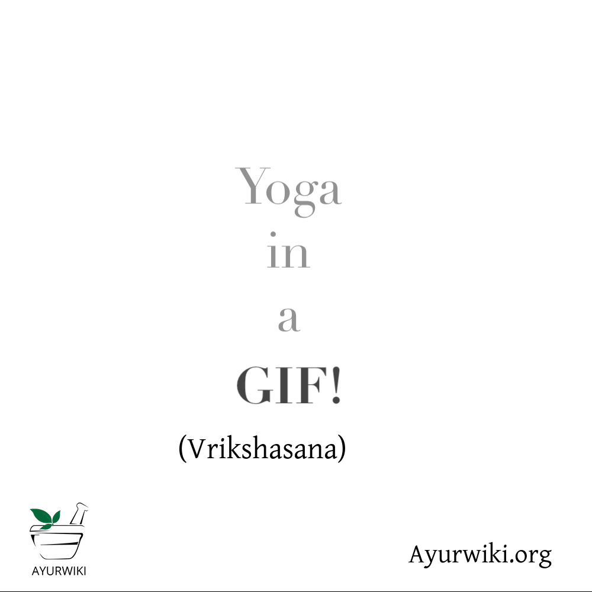
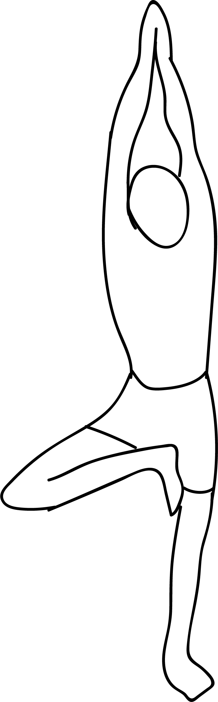

# Vriksasana

[TOC]

**Vriksasana** (Sanskrit: वृक्षासन; IAST: vṛkṣāsana) or Tree Pose is an asana.

## Technique
1. Stand in Tadasana (Mountain Pose) and shift your weight slightly onto your left foot, keeping your sole pressed firm against the floor, and then bend your right knee.
1. Reach down with your right hand and clasp your right ankle.
1. Draw your right foot up and place the sole against your inner left thigh; if possible, press your right heel into your thigh – just below your groin with your toes pointing toward the floor.
1. The center of your pelvis should be directly over your left foot.
1. Rest your hands on the upper portion of your pelvic bone. Make sure that your pelvis is in a neutral position, with the top rim parallel to the floor.
1. Lengthen your tailbone toward the floor.
1. Firmly press your right foot sole against your inner thigh and resist with your left leg.
1. Press your hands together in Anjali Mudra. Gaze softly at a fixed point in front of you on the floor about 4 -5 feet away
1. Stay in this pose for 30 seconds to 1 minute.
1. Step back to Tadasana with an exhalation and repeat for the same length of time with the legs reversed.

## Effects
* Improves balance and stability in the legs
* On a metaphysical level, helps one to achieve balance in other aspects of life
* Strengthens the ligaments and tendon of the feet
* Strengthens and tones the entire standing leg, up to the buttocks
* Assists the body in establishing pelvic stability
* Strengthen the bones of the hips and legs due to the weight-bearing nature of the pose
* Builds self-confidence and esteem

## Related Asanas
* [Trikonasana](Trikonasana.md)
* [Virabhadrasana II](../yoga/Virabhadrasana_II.md)
* [Baddha Koṇāsana](Baddha_Koṇāsana.md)

## Special requisites
Avoid doing this posture if you are suffering from migraine, insomnia, low or high blood pressure.

## Initial practice notes
If your raised foot tends to slide down the inner standing thigh, put a folded sticky mat between the raised-foot sole and the standing inner thigh.

## References

## External Links
* [Vriksasana on thehealthorange.com](https://thehealthorange.com/stay-fit/yoga/vrksasana-tree-pose-10-steps-benefits/)
* [Vriksasana on georgiestclair.com](https://georgiestclair.com/creative-business/benefits-tree-pose-creative-wellbeing/)
* [Vriksasana on zliving.com](http://www.zliving.com/fitness/yoga/tree-pose-vrksasana-tips-benefits-follow-up-yoga-poses-94303/)

## References

1. ["Methodology"](https://thehealthorange.com/stay-fit/yoga/vrksasana-tree-pose-10-steps-benefits/)
2. [tips"]("Beginers)(https://www.yogajournal.com/poses/tree-pose)
3. [benefits"]("Health)(http://www.cnyhealingarts.com/2010/10/29/the-health-benefits-of-vrikshasana-tree-pose/)
