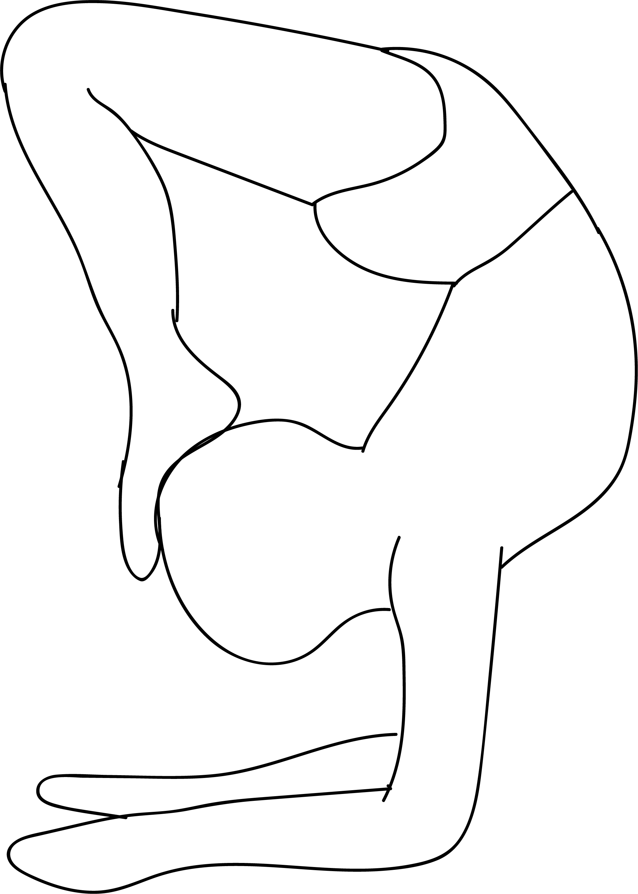

# Vrischikasana

[TOC]

**Vriscikasana (or Vrischikasana)** is an Asana. It is translated as **Scorpion Pose** from **Sanskrit**. The name of this pose comes from **vrischika** meaning **scorpion**, and **asana** meaning '''posture" or "seat". Vrischikasana has two variations: on the forearms and in a handstand.

## Technique
1. Start off in the Dolphin Pose. This pose is a variation of the Adho Mukha Svanasana or the Downward Facing Dog Pose. It is also known as the Catur Svanasana or the Quarter Dog Pose. It is similar to the Downward Facing Dog Pose, but instead of your bodyweight being borne by your hands and feet, the weight is borne by your hands, forearms, and feet.
1. Inhale and lift your right leg into the air as high as you can. You are now in the Tri Pada Adho Mukha Svanasana or the Three Legged Downward Facing Dog Pose.
1. Slowly kick the raised leg backwards, and lift your other leg off the floor as well. Now your entire body weight is on your palms, forearms, and elbows.
1. Center yourself as you strive for balance.
1. Arch your back and try to bring your feet as close to your head as possible by bending your knees. Concentrate on stabilizing your core muscles in order to maintain your balance.
1. Keep your head facing forward with eyes focused on an imaginary point on the floor in front of your arms.
1. Hold this posture for a couple of breaths.
1. Exhale and slowly come back to the starting position.

## Technique in pictures/animation
## Effects
* Strengthens your abdominal muscles and back as well as getting rid of fat from these areas
* Significantly strengthens your arms and shoulders
* Improves your balance
* Improves flexibility in the spine
* Builds stamina and endurance
* Allows a fresh rush of blood to the brain and can help to improve memory and concentration
* Stimulates hair follicles in the scalp
* Releases stress that can accumulate in the shoulders and spine

## Related Asanas
* [Adho Mukha Svanasana](../yoga/Adho_Mukha_Svanasana.md)

## Special requisites
* First and foremost, if you are new to this pose, it is a good idea to perform it under the guidance of a certified yoga instructor.
* Do not attempt this pose until your yoga trainer or guru tells you that you are ready for it.
* You should not perform this pose if you suffer from any hip or back problems.
* If you have a history of heart disease, it is best to avoid this posture.

## Initial practice notes
Here are a couple of beginners’ tips for performing the scorpion pose. When you are new to the Vrischikasana, you may initially find it difficult to balance your torso and legs in mid-air.

## References

## External Links
* [Vriscikasana on aliceallovertheworld.com](https://aliceallovertheworld.com/tag/running/)
* [Vriscikasana on thoughtbrick.com](https://thoughtbrick.com/yoga/yoga-forearm-scorpion-asana-vrischikasana/)
* [Vriscikasana on doyouyoga.com](https://www.doyouyoga.com/11-yoga-poses-to-prepare-for-scorpion-pose-15227/)

## References

1. ["Methodology"](http://www.yogawiz.com/yoga-poses/scorpion-pose.html)
2. [tips"]("Beginers)(http://www.yogawiz.com/yoga-poses/scorpion-pose.html)
3. [benefits"]("Health)(https://thoughtbrick.com/yoga/yoga-forearm-scorpion-asana-vrischikasana/)
