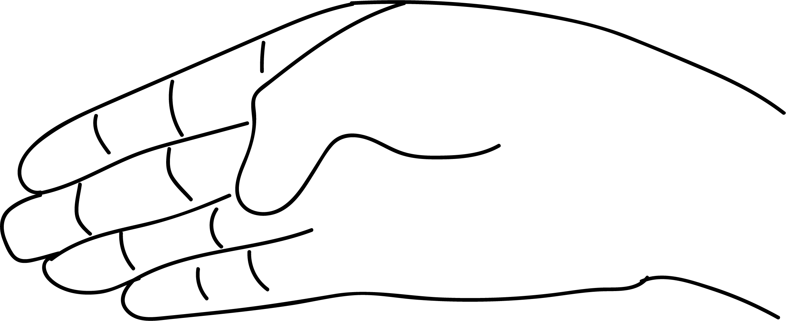

# Aditi Mudra

[TOC]

 Mudra*]]

## Formation
Place the tip of the thumb at the base of the ring finger.

## Effects
Ring finger represents prithvi and the thumb represents [Agni](../../concepts/Agni.md), when the Agni touches at the base to the ring finger there is a growth of prithvi element and also growth of [Agni](../../concepts/Agni.md). Therefore there will be weight again with improvement in stamina.

## Benefits
1. One can gain weight by a regular practice of 50 minutes followed by prana mudra. There will be remarkable weight gain.
1. Problem of sneezing continuously in the morning can be cured with the practice of this mudra. Yawning and sneezing during meditation can be prevented by practising this mudra.
1. Removes poisonous matter from the body.

## References

## References

1. **"MUDRAS & HEALTH PERSPECTIVES"** by ***"SUMAN.K.CHIPLUNKAR"*** page no 72
