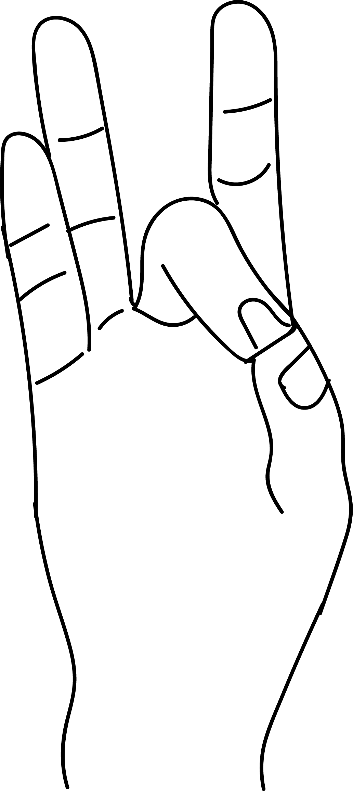

# Akasha Mudra

[TOC]

Space within the body is a part of outer space. A person becomes very broad minded when it is balanced.

## Formation
Formed by joining together the tips of the thumb and the middle finger.

## Effects
This is a detoxifying [mudra](mudra.md) that helps in increasing the space within the body and helps elimination of metabolic waste. Negative emotions like anger, fear and sorrow are replaced by positive emotions.

## Benefits
1. Helps to detoxify the body by the elimination of metabolic wastes through exhaled air, sweat, urine and stools.
1. Helps to overcome feeling of fullness, heaviness in the body.
1. Helps to overcome discomfort caused by over eating.
1. Helps to relieve congestion and pain in the head due to migrainer or sinusitis, ears due to infection, chest congestion, infection, asthma etc.
1. Relieves pain in angina pectoris, regularises heart beats and high blood pressure. Practise this mudra daily for 50 minutes.
1. This mudra aids in meditation. It helps purify emotions and thoughts. Vibration can be felt on the top of the head at Sahasrara Chakra and one gets divine power with an increase in intuition and alertness.
1. This mudra is beneficial for any bore related diseases, as the **calcium** content within the body increases.
1. This mudra removes tooth problems and makes the teeth strong.
1. Locked jaws caused due to yawning can be cured with the flip pf middle and thumb fingers. This is why, traditionally, during yawning fingers are flipped.
1. helpsa to balance the body while walking, climbing up or down.
1. If the resary beads are placed on the middle finger and rotated with the help of thumb mind enjoys prosperity, power and material happiness. Heart gets strong.
1. This mudra is more beneficial at dawn.
1. Akasha mudra is an excellent mudra which stimulates noble thoughts and helps the practitioner to take rapid strides along the path to liberation from widely desires.
1. Akasha mudra prevents jet lag. perform this for an hour during the flight.

## References

## References

1. **"MUDRAS & HEALTH PERSPECTIVES"** by ***"SUMAN.K.CHIPLUNKAR"*** page no 53
