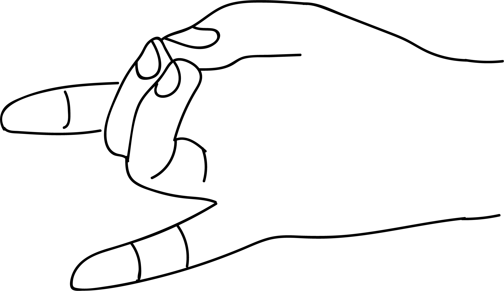

# Apana Mudra

[TOC]

According to yogic  [Physiology](../../physiology/Physiology.md) , the vital pranamaya kosha is made up of pancha pranas - the five winds: prana, udana samana, apana and vyana.
Apana vayu is concerned with the expulsion of body wastes in the form of sweat, urine, faces etc. Apana mudra facilitates expulsion of waste from the body and keeps the body clean.

## Formation
Tip of the thumb is to be joined to the tips of the middle and the ring fingers.

## Effects
Apana mudra is a combination of agni, akasha and prithvi elements. Combination of these elements improves digestion and provision of calcium and vitamins.

## Benefits
1. This mudra helps improve the flow of perspiration, urine and stool. Apana mudra can be used to overcome the following disorders:
1. Anuria - Absence or obstruction of urine.
1. Constipation of sweat.
1. Absence of problems such as stomach pain, vomiting, hiccups and restlessness.
1. Soothes tooth ache. In general, practising this mudra everyday for 10 minutes helps maintain healthy teeth.
1. diabetes is controlled by a disciplined practice of this mudra for 50 minutes followed by prana mudra for 15 minutes (one should also perform pranayama for 30 minutes. Diabetics should follow these mudras lifelong to keep diabetes in control.)
1. Acidity is pacified.
1. Migraine would be cured with apana mudra and jnana mudra each for half an hour.
1. For safe painless delivery a pegnent lady should practise this mudra daily for 10 minutes a month before the due date.

## References

## References

1. **"MUDRAS & HEALTH PERSPECTIVES"** by ***"SUMAN.K.CHIPLUNKAR"*** page no 58
