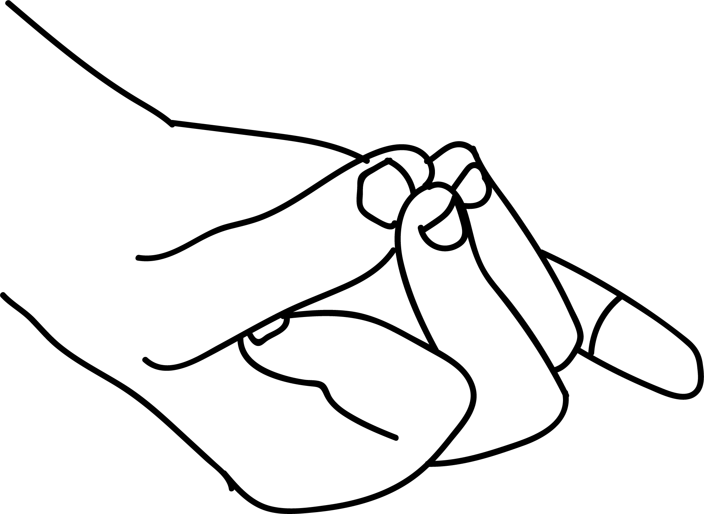

# Apana Vayu Mudra

[TOC]

**Apana Vayu Mudra** can save a person a 'Heart attack. Hence this mudra is called the sanjeevani mudra, one that gives life to a dying person. This [mudra](mudra.md) gives instant results and the pain is reduced immediately.

## Formation
This is a combination of two mudras. Vayu and apana. Form [Vayu Mudra](../../yoga/mudras/Vayu_Mudra.md) by placing the tip of index finger at the base of the thumb and then form [Apana Mudra](../../yoga/mudras/Apana_Mudra.md) bu joining the tips of thumbs with the middle and ring fingers. This can also be formed the other way shown in the picture.

## Effects
There is combined effect of vayu mudra and apana mudra. Vayu mudra amd apana mudra. Vayu mudra relieves the pain instantly and apana mudra maintains space to reinforce blood circulation to the heart.

## Benefits
1. When one gets the symptoms of a heart attack this mudra will act like an injection and helps the person to recover from pain instantly. It reduces excess gas from stomach and makes the heart muscles to work efficiently.
1. Chest pain, tiredness and perspiration will be reduced immediately.
1. This mudra removes the blocks in the blood veins.
1. Irregular heart beats are regulated.
1. Even a little pain in the chest region out the excess vayu from the chest region and feels comfortable.
1. That is why this mudra is called 'mrita sanjeevani' one which saves from the clutches of death.
1. Too much perspiration in the feet and hands is pacified.
1. Headaches due to lack of sleep mental worries, over exertion and problems of blood circulation are relieved.
1. Beneficial in curing acidity.
1. Migraine headache gets relief.
1. If urination is blocked this mudra relieves the problem and within 10 - 15 minutes block is removed and the person passes urine.
1. Beneficial in relieving tooth ache.
1. The functional capacity of various organs of the digestive system increases.
1. this mudra cures - Arthritis, spondylitis,parkinson and paralysis.
1. **Varicose vein pain is rectified with both apan vayu mudra and hridaya mudra. Half an hour each every day followed by prana mudra fifteen minutes, till get cured**.

## Note
* Perform Apana Vayu mudra:
1. When there is sleeplessness.
1. When there is over exertion.
1. When there is stress.
1. When climbing staircases and hills.
1. When there is crisis.

## References

## References

1. **"MUDRAS & HEALTH PERSPECTIVES"** by ***"SUMAN.K.CHIPLUNKAR"*** page no 75
