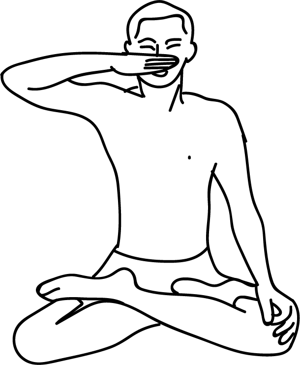

# Bhoochari Mudra

[TOC]

Sit in any meditative [asanas](asanas.md) like padmasana, sukhasana, siddhasana or swastikasana. Using your hand fix a point 4 to 5 inches from the tip of the nose. Removes the hand and concentrate on the point. This is Bhoochari Mudra. Along with this one can perform jnana mudra, dhyana mudra which will give greater benefit. This mudra can be performed for 5-10 minutes everyday.

## Effects
The Ajna chakra gets activated by focussing eyesight between the two eyebrows.

## Benefits
1. Activating ajna chakra increases awareness and reasoning power.
1. This mudra enhances concentration awareness ans creates a rich base for long meditation.

## References

## References

1. **"MUDRAS & HEALTH PERSPECTIVES"** by ***"SUMAN.K.CHIPLUNKAR"*** page no 90
