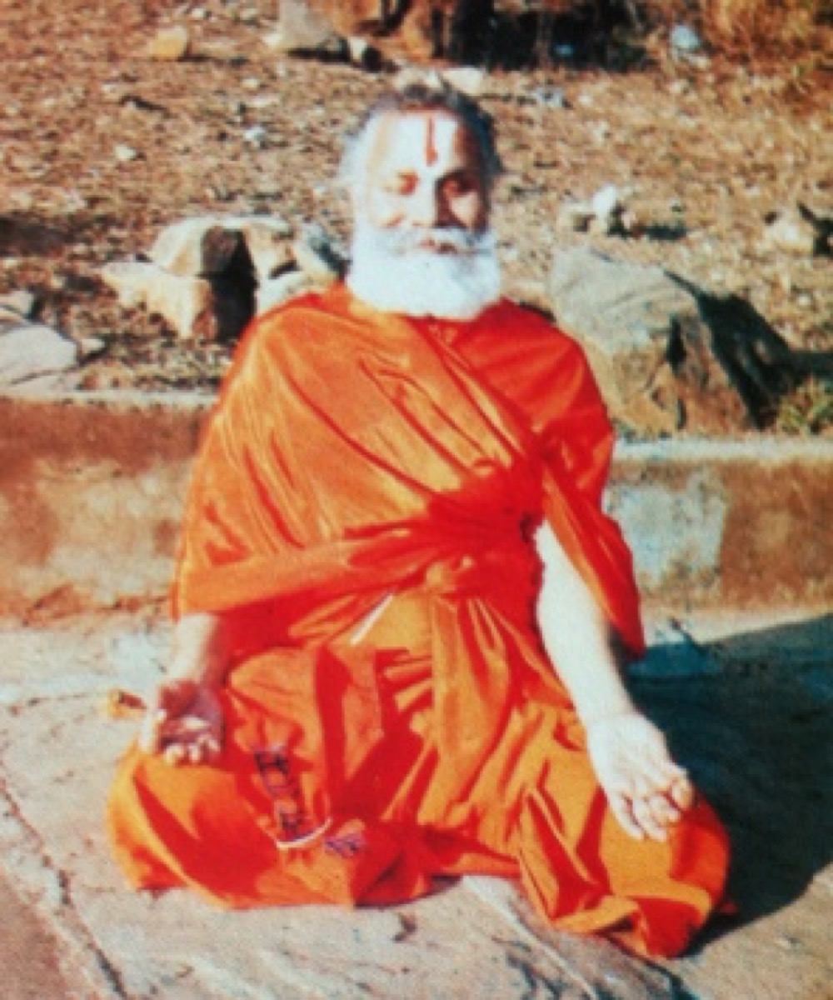

# Chin Mudrā

* The thumb and forefinger on each of the hands are joined, forming a zero. The rest of the fingers are extended. The hands are placed palms-up on the thighs or knees while sitting in vajrasana.

## Uses
1. This Mudra activates the diaphragm, making for deep "stomach-breathing" as the diaphragm pushes out the internal organs when it descends towards the pelvis on inhalation.
1. Slow breathing in a 5-2-4-2 mentally counted rhythm (being; 5 the exhalation, 2 the breath retention and 4 the inhalation) causes prana flow in the pelvis and in the legs.
