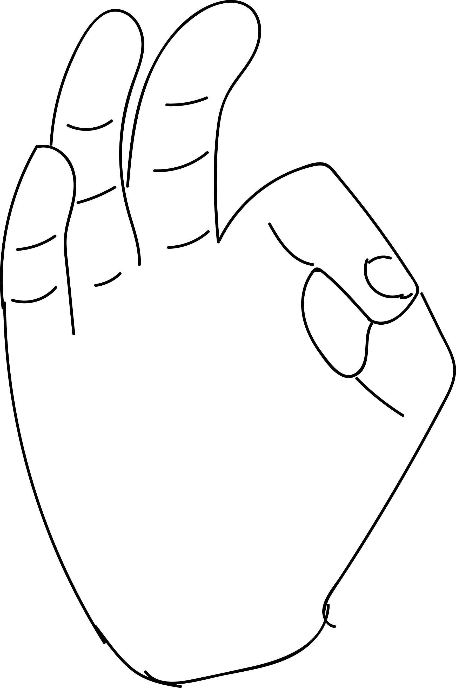

# Dharana Shakti Mudra

[TOC]

**Dharana** means to retain the breath for lomger time.

## Formation
* This [Mudra](Mudra.md) has three stages.
1. Start inhaling with the thumb tips pressing the tip of the index finger. This helps in retention of the breath for longer time.
1. Next press the middle part of the thumb and keep on inhaling for some more time. Retention of breath is still longer.
1. Then press the base part of the thumb and retention of the breath can be still longer.

## Effects
The lungs get more oxygen by retention of breath.

## Benefits
The longer the breath the more is the oxygenation of the body resulting in pure blood and a stronger body. To a large extent, practising this mudra reduces the total number of breaths in the day. This is turn, increases longevity.

## References

## References

1. **"MUDRAS & HEALTH PERSPECTIVES"** by ***"SUMAN.K.CHIPLUNKAR"*** page no 78
