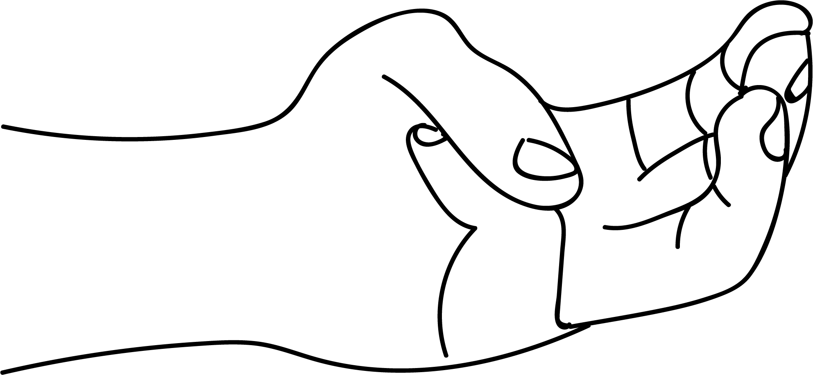

# Jalodara Nashaka Mudra

[TOC]

Jala means water. Udara means stomach & Nashaka means to end. The little finger signifies water element. **Jalodara Nashaka mudra** controls like excess of water element in the stomach.

## Formation
The tip of the little finger is placed at the base of the thumb and the thumb is placed on the back of the little finger gently.

## Effects
Jalodara nashaka mudra reduces the excess water element in the body, suitably affecting the water metabolism. It can thus overcome water logging within the body.

## Benefits
1. Jalodara is a Sanskrit term for the disease - Dropsy. This disease is caused due to excess of water content in the stomach. This mudra is named after the curing of the disease - Jalodara.
1. This mudra can cure elephantitis.
1. Swelling in any part of the body like face, hands and legs can be cured with this mudra.
1. This mudra cures excessive salivation, water eyes, running nose, hyperacidity, diarrhoea (loose motion).
1. Pleurisy, effusion in ajoint is cured.
1. Excessive menses is balanced.
1. Excessive urination is cured.
1. Menstrual date can be postponed by the practice of this mudra for 15 minutes daily 3 days prior to the date of periods.

## References

## References

1. **"MUDRAS & HEALTH PERSPECTIVES"** by ***"SUMAN.K.CHIPLUNKAR"*** page no 66
