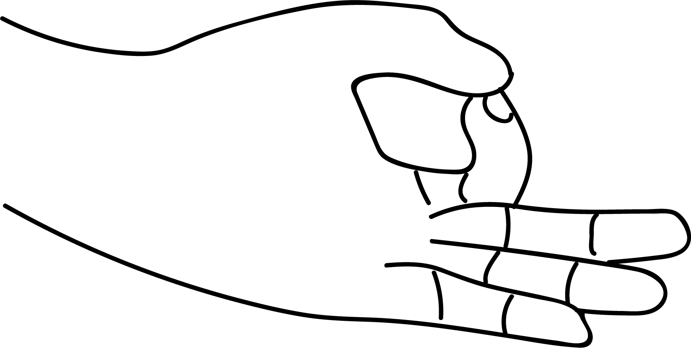

# Jnana Mudra - Mudra of Wisdom

[TOC]

The **Jnana Mudra** is done by touching the tips of the thumb and the index together, forming a circle, and the hand is held with the palm inward toward the heart. Jnana mudra balances vayu in our body and steadies the mind.

## Formation
This mudra is formed by joining together the tips of the thumbs and the index finger.

## Effect
Vayu causes movements and thoughts. Agni related to the brain. When the tips of the index finger and the thumb join together the vayu gets stabilized. Vayu and Agni together control the mind. That is why this mudra is calles Jnana Mudra - **Mudra of Wisdom**.
At the top of the thumb lie the points of the endocrine glands pituitary and pineal. Performing this mudra balances their secretion.

## Pituitary gland
This gland controls air and space in the body. This is the king of all glands. So it sends orders to all other glands. This gland controls will power, sight, hearing, memory and sense of discrimination.
Pituitary controls the growth of the body. An over worked pituitary gland makes people physically big in size. While under worked pituitary may result in making them smaller in size.
This gland also governs the growth of the mind-brain. This gland may be damaged due to fear, injury or tension during pregnancy, leading to malfunctioning of the other glands and that in turn, could result in giving birth to mentally retarded children. An improper functioning of this gland tends to make people mean, liars and bullies.
As pituitary and pineal glands are situated in the head it is harmful to hit the children on head.
When pituitary gland is predominant it helps people to become great geniuses, eminent literary men, poets, scientist, philosopher and lovers of mankind.

## Pineal gland
Pineal gland also controls the development of other glands and regulates them. Malfunctioning of this gland leads to high BP and sex delinquency. Moreover it controls the potassium and sodium balance in the body. Its malfunctioning leads to excessive retention of fluids. This gland controls the proper flow of cerebro spinal fluid thus keeping all the glands and body vitalised, strong and healthy.
This gland is also knopwn as the 'Third Eye'. The predominance of this gland generates a sense of sublimity helping men to grow into saints, endowed with divine qualities. These people have great wisdom and willpower. They are not affected by physical suffering or sorrow. In modern times stress/ tension/ worry/ fear have increased and these often disturb all endocrine glands. Therefore balancing these glands with Jnana mudra become very crucial.

## Benifits
1. Tendons, venis become strong.
1. Mental power of grasping, concentration and memory increases.
1. Empower the mind causing a positive effect on emotions and leading to enlightenment.
1. Facilitates movements of electrical impulses along nerves.
1. Empowers the pituitary gland and thereby the entire system of endocrine glands.
1. Empowers the muscles both voluntary an involuntary.
1. Empowers the vocal cords and voice by empowering the thyroid gland.
1. Mental maladies like - madness, hysteria, dullness of mind, lack of initiative, loss of memory, lethargy, frestlessness,fear and phobias and depression are cured.
1. Disorders of the nervous system like cerebral palsy, alzheimers disease and neuritis are rectified.
1. degeneration of the retina and topic atrophy are set right.
1. Endocrine - hormonal disorders like hypo petuitarism (Dwarfism) hypo-thyroidism, diabetes etc. are cured (with a 50 minutes practice everyday). Muscular disorders facial palsy, monoplegia and paraplegia are cured by regular practice of jnana mudra.
1. Bad habits like addiction, intoxication can be overcome.
1. Violent and cruel behaviour is due to mental imbalance which would be overcome by this therapy - jnana mudra 50 minutes followed by prana mudra 15 minutes.
1. For students jnana mudra as a boon. This improves memory, develops concentration and improves brain power. mental development in manifold.
1. Mentally retarded children will benefit - when they sleep, put a band around the jnaan mudra as there is no time limit to perform this mudra.
1. Sleeplessness and insomnia  can be cured by practising 50 minutes of jnana mudra  followed by 15 minutes of prana mudra.
1. Tension is removed, anger is pacified.
1. Soothes irritability, harsh behaviour.
1. Aids in withdrawal from **SMACK,LSD,MORPHINE,BHANG,CHARAS,COCAINE and GANJA**.
1. Increases commitment to work and selfless devotion to duty.
1. Aids in the awakening of intuition which leads to a feeling of awareness and joy.

## References

## References

1. **"MUDRAS & HEALTH PERSPECTIVES"** by ***"SUMAN.K.CHIPLUNKAR"*** page no 48
