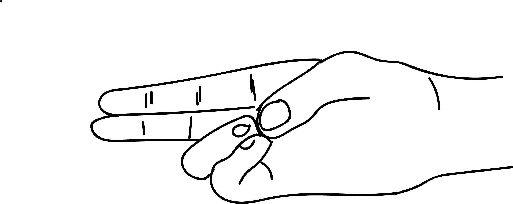

# Kidney Mudra

[TOC]

This mudra cures kidney disorders. This has the same qualities like jalodara nashaka mudra.

## Formation
The little finger and the ring finer tips are to be placed at the base of the thumb and thumb should be placed over the two fingers.

## Effects
Water content is reduced and heat is increased.

## Benefits
1. The problem of running nose  and watering of eyes is cured.
1. Throat pain is pacified immediately.
1. Problems of phlegm in the throat and lungs is cured.
1. Helps in curing kidney related problems.
1. Helps in curing dropsy.
1. Loose motion is cured immediately.
1. Discontinue performing this mudra when alignment is cured.

## References

## References

1. **"MUDRAS & HEALTH PERSPECTIVES"** by ***"SUMAN.K.CHIPLUNKAR"*** page no 67
