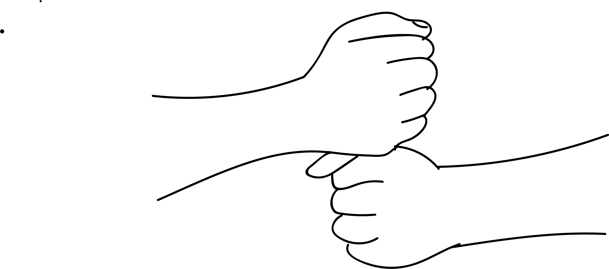

# Kundalini Mudra

[TOC]

**Kundalini mudra** is associated with the reproductive energy.

## Formation
Form the first of the left hand and extend the index finger. Cover the index finger with right hand fingers and place the right thumb on the top. Hold this mudra in front of the abdomen for 15 minutes, three times a day.

## Effects
This mudra enhances the kundalini  force and the energy is released.

## Benefits
This mudra promotes vigour in the couple. The reproductive energy is set right in the couple. Both have to practice this mudra for 15 minutes thrice a day.

## References

## References

1. **"MUDRAS & HEALTH PERSPECTIVES"** by ***"SUMAN.K.CHIPLUNKAR"*** page no 77
