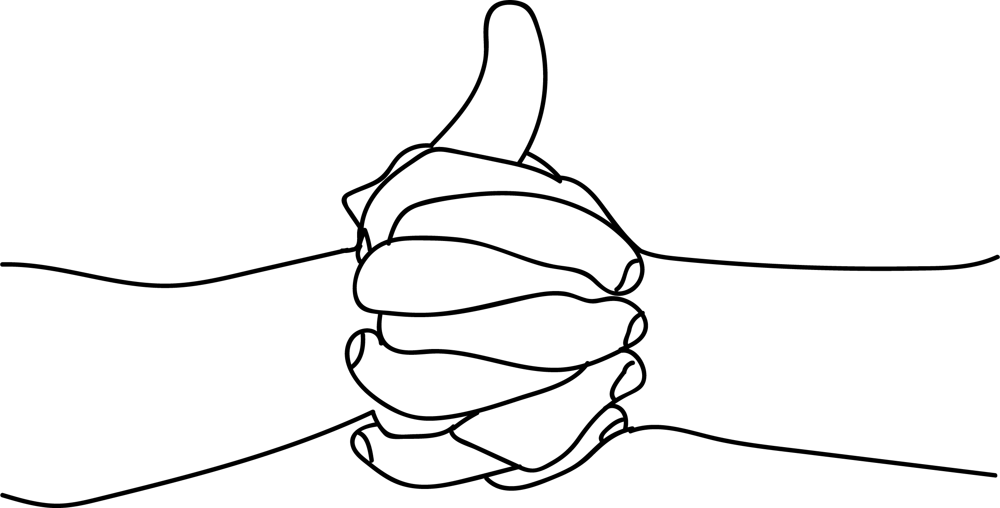

# Linga Mudra

[TOC]

**Linga Mudra** increases bodily heat as it reinforces the fire element.

## Formation
Linga mudra is formed by interlocking the palm but keeping the left thumb erect pointing upward. This mudra can be done by reversing the hand too.

## Effects
The fire in the thumb is activated and is able to increase uninhibited.

## Benefits
1. Hypothermia - shivering and chills due to cold weather can be controlled.
1. Ailments caused by over production of mucus such as wet cough, cold, sinusitis etc. can be cured.
1. Asthma, bronchitis, T.B., pleurisy are cured.
1. Discomfort experienced in an air conditioned room is relieved by this mudra.
1. Increases digestive powers and also melts excess fat in the body. Give better results when performed together with soorya mudra - both 15 minutes each, one after the other.
1. Difficulty in breathing can be relieved by this mudra.
1. Congested nose can be relieved by this mudra immediately and one can get good sleep.
1. Regulates the flow of the menstrual cycle. Give better results when performed together with surya mudra - both 15 minutes each, one after the other.
1. When navel centre is shifted from its original place, comes back to its place by this mudra.
**Special Note**:This mudra increases heat in the body so this mudra is to be performed only for 15 minutes or less. But when there is congestion and cold continue this mudra for 30 minutes twice a day followed by peana mudra for 10 minutes. Since this mudra generates heat one must consume a lot of liquids like water, fruit juices, ,ilk, buttermilk etc.
* **Any one suffering from acidity, fever and stomach ulcers should not perform this mudra**.
* **This mudra is to be performed only till the problem persists and then it should be discontinued**.

## References

## References

1. **"MUDRAS & HEALTH PERSPECTIVES"** by ***"SUMAN.K.CHIPLUNKAR"*** page no 68
