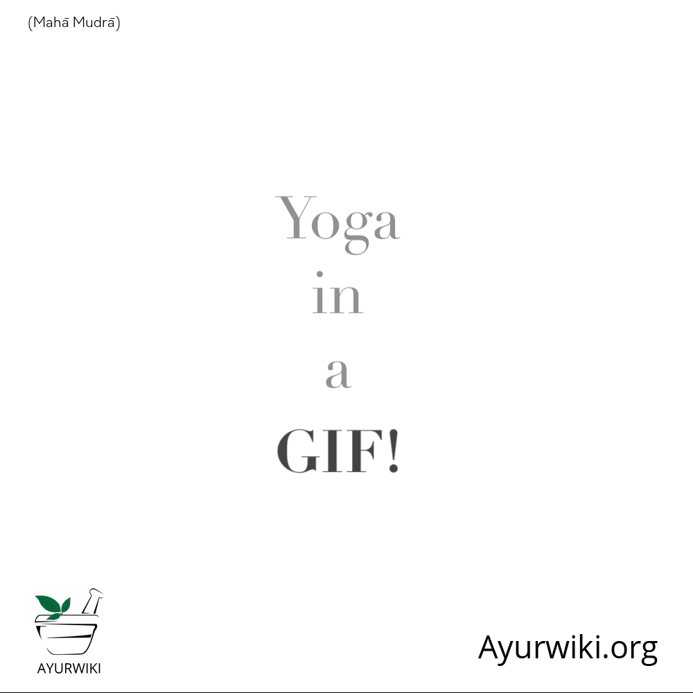
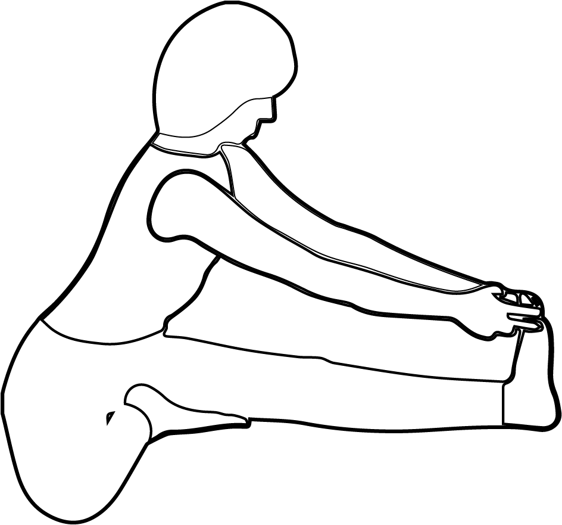

# Maha Mudra

[TOC]

## Formation
Sit and stretch the left leg. Bend the right knee so that the right heel touches the anus. While taking a long breath bend forward and hold the toe of the left leg. Try and touch the tip of the nose to the left knee and hold the breath for a few seconds. Then exhale slowly and come back to the original position.  Perform the same way with the right leg. This is maha mudra.

## Effects
Maha mudra helps in activating kundalini shakti. Sushuma nerve gets activated, inspiring kundalini to rise towards higher chakras. Practice this mudra 10 times.

## Benefits
1. Constant practice of maha mudra may cure tuberculosis, leprosy, ulcer at the anus, piles also controls diabetes.
1. Body and mind become radiant because of sushumma nerve getting activated.

## References

## References

1. **"MUDRAS & HEALTH PERSPECTIVES"** by **"SUMAN.K.CHIPLUNKAR"** page no 93
