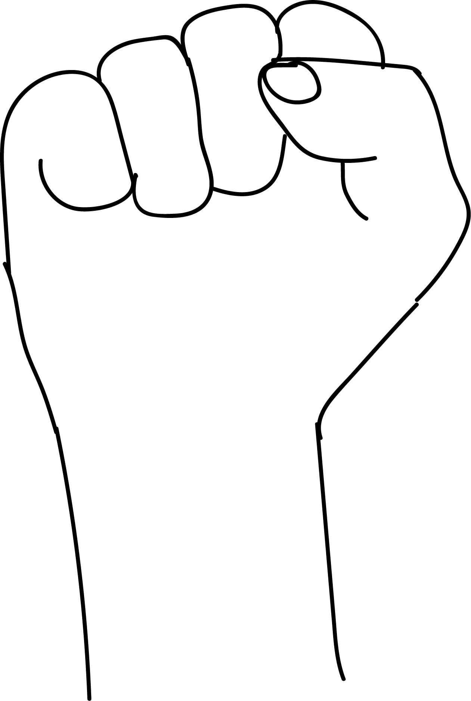

# Mushthi Mudra

[TOC]

**Mushthi**is the tight fist which is the symbol of force. This mudra promotes digestion, helps cure constipation and lethargy.

## Formation
Form the fist with both hands and place the thumbs on the back of the ring fingers.

## Effects
This mudra is the combination of vayu mudra, shoonya mudra, soorya mudra & jalodara nashaka mudra which decreases all the four elements there by solving the problems of the excesses of the four elements namely vayu, akasha, prithvi & jala. The agni affecting soorya mudra generates heat and energy in the body.

## Benefits
1. Whwn feeling depress, discouraged or suffering from physical discomforts like: Shivering, phlegm in the wind pipe or feeling of lethargy and inertia, perform this mudra for 50 minutes followed by prana mudra.
1. Reduces the tingling in the body parts.

## References

## References

1. **"MUDRAS & HEALTH PERSPECTIVES"** by ***"SUMAN.K.CHIPLUNKAR"*** page no 79
