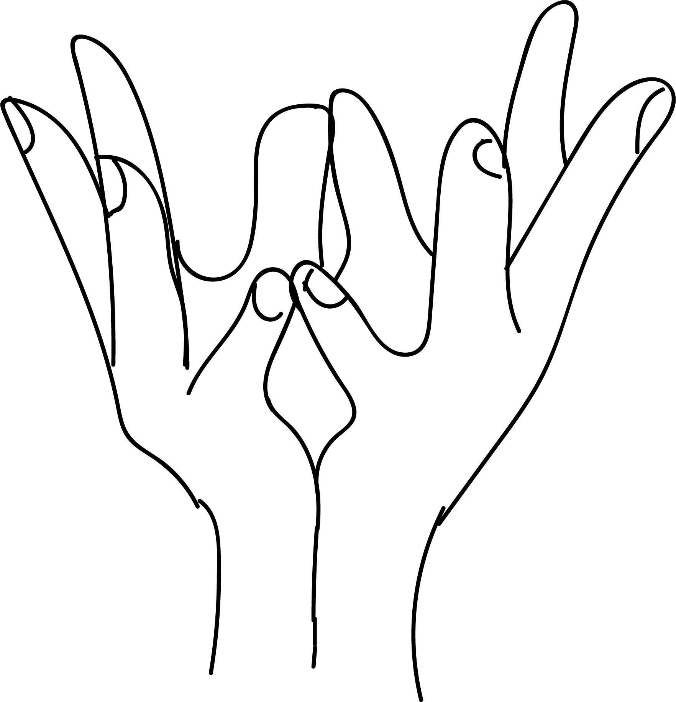

# Pankaja Mudra

[TOC]

**Pankaj** mean lotus. It grows in water and is considered very scared in India. A number of gods and goddesses like Brahma, Laxmi, and saraswathi have lotus as their seat. We form pankaj mudra as a symbol of purity and offering. It is a part of worship.

## Formation
Join the two palms facing each other. Join the thumbs and the little fingers. Form the other fingers like a blooming lotus.

## Effects
The thumb represents fire and the little fingers represent water. Joining these fingers means purifiring the body and mind.

## Benefits
* The thumb becomes calm and pure. The body also becomes cool.
* This mudra pacifies fever in a short time.
* The beauty of the face is enhanced by this mudra.

## References

## References

1. **"MUDRAS & HEALTH PERSPECTIVES"** by ***"SUMAN.K.CHIPLUNKAR"*** page no 77
