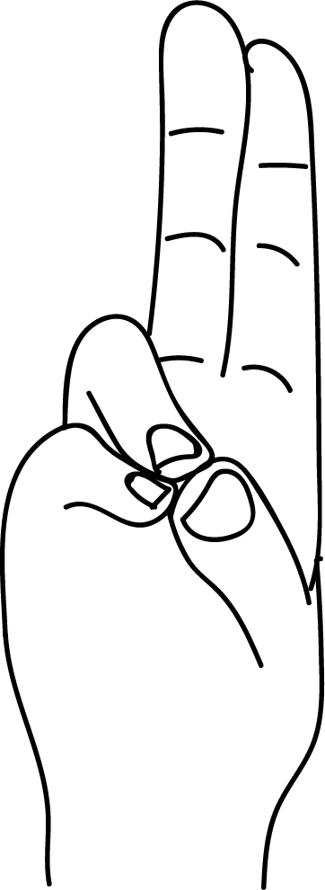

# Prana Mudra

[TOC]

A complicated mudra combining hand gestures, synchronized movement from gesture to gesture within the breath cycle, and meditation. The mudrā is practiced sitting in Siddhasana. Even a single breath cycle of this mudra can significantly stimulate the body. It is described in the book, Theories of the Chakras, by Hiroshi Motoyama. Prana vayu is very important vayu among the ten types of vayu-s which exist in the body. Prana vayu is breath itself. It is found in the nostrills, face, heart and respiratory organs. It covers the space till the navel.

## Formation
The tips of little fingers and ring fingers are joined with the tips of the thumbs.

## Effects
The major part of our body is prithvi and jal. Joining the finger tips balancing these elements results in increasing stamina, vitality, strength and immunity. This mudra starts the flow of vital energy in our body as if life dynamo has been started. While practising meditation along with this mudra, the whole body feels the vibration. Practising this mudra makes a person mentally and physically strong.

## Benefits
1. Prana mudra helps to over come the following disorders:
1. Cronic fatigue, general debility, low endurance.
1. Impaired immunity.
1. Mental tension, anger, irritability, jealousy, pride, restlesness.
1. Inflammatory disorders.
1. Forgetfulness.
1. Scanty,burning,urination.
1. Burning red, dry, eyes, cataract.
1. Dry red got again skin, skin rashes, urticaria and leprosy.
1. Any ailment of eyes is cured, eyesight is imporved.
1. The element of earth, water and fire are joined, so this helps remove the obstacles present in blood vessels resulting in improved blood circulation.
1. This mudra removes impurities present in blood and stimulates joy, energy, delight, zeal, hope and perseverance.
1. Prana mudra helps remove any kind of deficiency of vitamins A,B,C,D,E and K. All vitamins are provided by this mudra.
1. Any type of cramps in muscles or veins and pain in the legs are cured.
1. During fasts this mudra can help contol hunger and thrist.
1. To treat any disease prana mudra is like a friend that helps other mudras.
1. To cure insomnia, jnana mudra is to be followed by prana mudra.
1. To cure diabetes apana mudra is to be followed by prana mudra.
1. Numbness in any part of the body is cured by prana mudra.

## References

## References

1. **"MUDRAS & HEALTH PERSPECTIVES"** by ***"SUMAN.K.CHIPLUNKAR"*** page no 59
