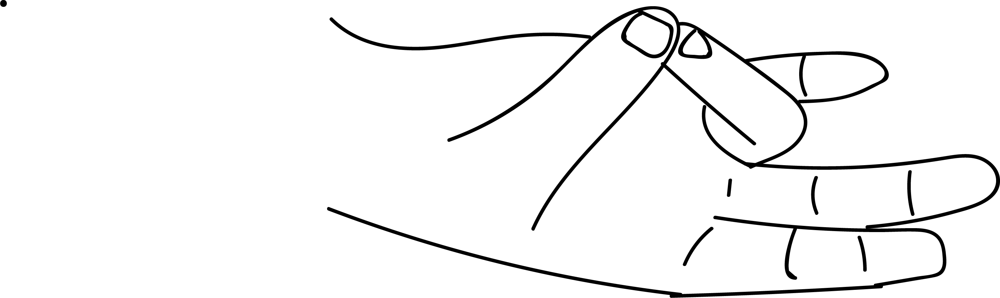

# Prithvi Mudra

[TOC]

The element Prithvi - earth, is a vital component of bodily tissues like bones, certilage, skin, hair, nails, muscles, tendons and internal organs. This element builds and invigorates the tissues and increases vitality, strength and endurance. This element is associated with smell and hence it helps to overcome nasal disorders. Prithvi also reduces fire, so an overactive Agni can be pacified.

## Formation
Join the tip of the ring finger with the tip of the thumb.

## Effects
Since the elements fire and earth have qualities opposed to each other, prithvi mudra when formed cools the body and reduces the fire and helps overcome disorders of emaciation, fever and inflammation.

## Benefits
1. Chronic fatigue, general debility (weakness after illness) and convalescence (recovery time) can be overcome.
1. Treats lack of stamina or endurance.
1. Treats emaciation and weight loss.
1. Osteoporosis, Osteo malacia - diminished bone density and rickets can cured.
1. Helps to expedite the union of bones on case of a fracture.
1. Degeneration of articular cartilage is treated.
1. Helps to strengthen the limbs in polio myelitis, paralysis.
1. Dry, cracked, burning skin is pacified, fever is pacified.
1. Cures skin rashes and urticaria ( the skin allergy).
1. Brittle nails are set right.
1. Cuts and wounds are cured.
1. **Hair loss and premature greying of hair can be treated with the practice of this mudra. Grey hair wprana mudra for 15 hich is recent one turns black within  7 days by minutes. If the condition is older one then one has to practise this mudra for longer duration like months together**.
1. Burning sensation in eyes, stomach, urine, anus, hands or feet is pacified.
1. Aphtous ulcers in the mouth are cured.
1. Jaundice is cured.
1. Fever is pacified.
1. Complexion of the skin radiates with health.
1. This mudra provides A, B, C, D, E, K vitamins.
1. **This mudra makes one feel happy and contented**.
1. **Makes the mind generous**.
1. **Prithvi mudra is a beauty aid, can shape eyes, nose, lips, by drawing the mudra along the part concerned**.

## References

## References

1. **"MUDRAS & HEALTH PERSPECTIVES"** by ***"SUMAN.K.CHIPLUNKAR"*** page no 55
