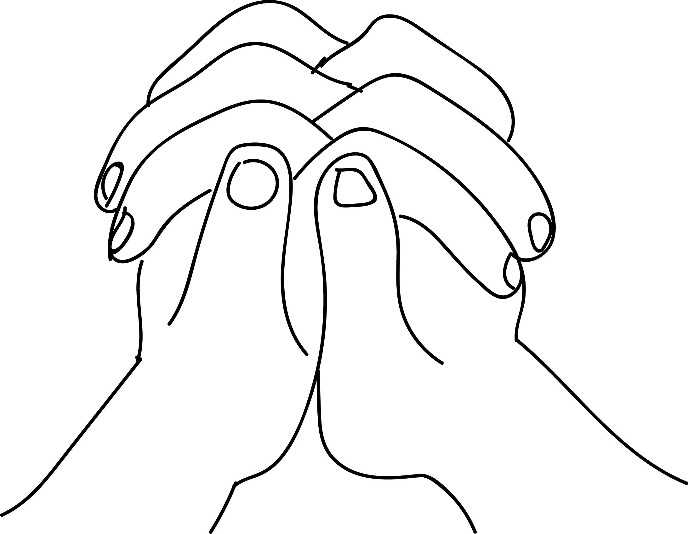

# Sahaja Shankha Mudra

[TOC]

**Sahaja Shankha Mudra** is a version of shankha mudra. Benefits are also the same with a few exceptions.

## Formation
Join both hands together interlocking the fingers and press the palms together. Apply a gentle pressure with both the thumbs by laying them parallel to each other on the index finger.
This forms the sahajan shankha mudra.

## Effects
According to yoga physiology, all 10 main nerves get activated and the body becomes very strong with this mudra. The ten main nerves and sushumna, ida, pingala,gandhari,hasti jiva, poosha, yashwini, alamboosha, kuhoo and shankhini.

## Benefits
1. There is growth in alertness.
1. The nerve Shankhini would activate mooladhara chakra. The serpent power kundalini rises towards higher levels.
1. Remove the problem related to the anus.
1. The spinal coed becomes straight and gains flexibility.
1. Slip disc problem is resolved.
1. Like the shankha mudra this mudra helps in solving problems related to speech, voice, digestive power, stomach and intestine.

## References

## References

1. **"MUDRAS & HEALTH PERSPECTIVES"** by ***"SUMAN.K.CHIPLUNKAR"*** page no 30
