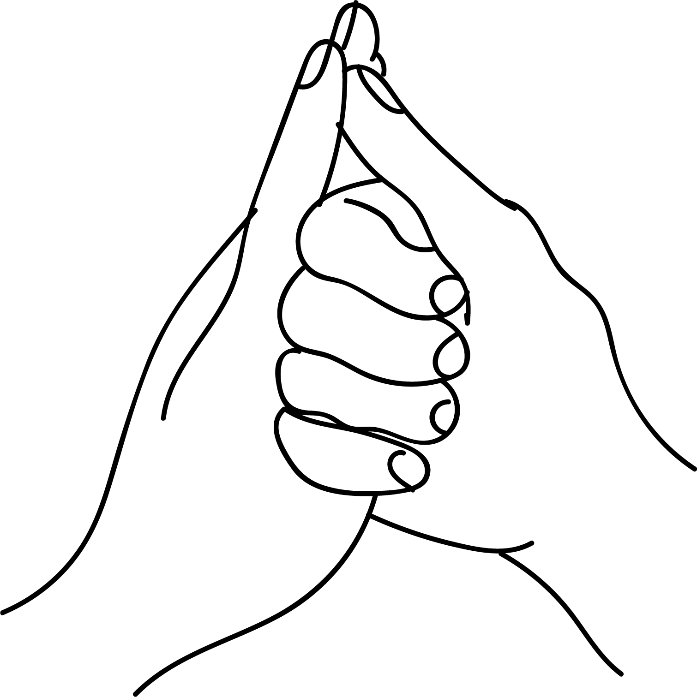

# Shankha Mudra

[TOC]

In Sanskrith **Shankha** means conch. This mudra resembles the shape of a conch and hence is called the Shankha mudra. In ancient times it was believed that blowing the conch could send sound waves far and wide, thereby removing ill effects of the bad elements.

## Formation
Place the thumb of the left hand at the base of the right thumb. This is the point of thyroid gland in the palm. Fold the fingers of thee right hand covering the left thumb. Join the index finger of the left hand with the thumb tip of the right hand. The other three fingers of the left hand are to be placed on the back of the right palm. The mudra can be performed with reversing hands too.

## Effects
The thumb which represents the element fire is covered by the fingers hence fire is subduced. The union of  left index finger and thumb creates balance of wind.

## Benefits
1. Shankha mudra can be used to overcome the following disorders:
1. Feverish feeling in the body.
1. Burning in the body/ body parts.
1. Allergic disorders especially skin rashes.
1. Voice larynx and throat pharynx peoblems.
1. Flabbines.
1. Weakness, paralysis of muscles.
1. This mudra plus pressure on the point of thyroid gland, thus making it active to remove illnesses related to thyroid gland, so obesity is regulated.
1. This mudra makes the voice melodious and clean.  Removes strain in the voice. Therefore singers, teachers, doctors,  lawyers and leaders must perform this mudra every day for 10 minutes.
1. This mudra relieves allergies, caused by dust and smoke, so throat becomes clean; also pacifies skin rashes.
1. Tonsillitis and other throat infections are cured.
1. Any trouble of stammiering, stuttering in speech can be rectified by this mudra.
1. After a paralytic attack, this mudra helps in dealing with speech problems and speech becomes clear.
1. Helps in increasing height of children.
1. Kidney problems are cured.

## References

## References

1. **"MUDRAS & HEALTH PERSPECTIVES"** by ***"SUMAN.K.CHIPLUNKAR"*** page no 69
