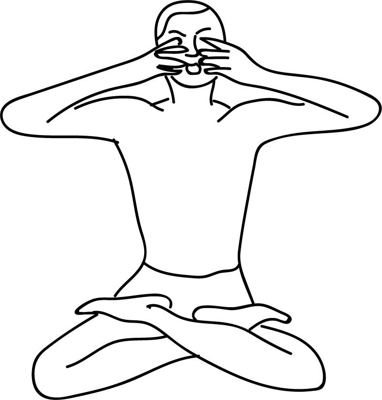

# Shanmukhi Mudra

[TOC]

## Formation
Sit in padmasana, both the hands should be raised to the level of face, forearms should be at the level of shoulders. Block the earholes with thumbs. Close the eyelids and place index finger on the upper part of the eyelids. Place the middle finger at the lower part of the eyelids gently. The eyeballs are fixed between the index and middle fingers. They symbolise vayu and akasha elements. Now slightly press the right and left nostrils with the ring fingers and place the small fingers at the corners of the upper lip. Breathe slowly and be in this position for 10-15 minutes.In this state one will hear a low but distinct sound produced within. This sound is Omkar. Listen and enjoy it with concentration. Then inhale and Say OM.

## Effects
By closing all the outlets of five senses body get energy from the mooladhara charaka and the energy passes through all chakras. As a result of this upward movement of energy, brain becomes very active and alert. The five elements come into contact with the five sense organs. Hence all sense organs get activated and the face becomes radiant.

## Benefits
1. Kundalini energy gets activated and one becomes bright and active. Mind becomes introvert and wnlightened.
1. By recitation of omkar, the brain gets better blood circulation and is rejuvinated.
1. Shanmukhi mudra is very beneficial to children. By practising this mudra the power of thinking and memory becomes strong.

## References

## References

1. **"MUDRAS & HEALTH PERSPECTIVES"** by **"SUMAN.K.CHIPLUNKAR"** page no 91
