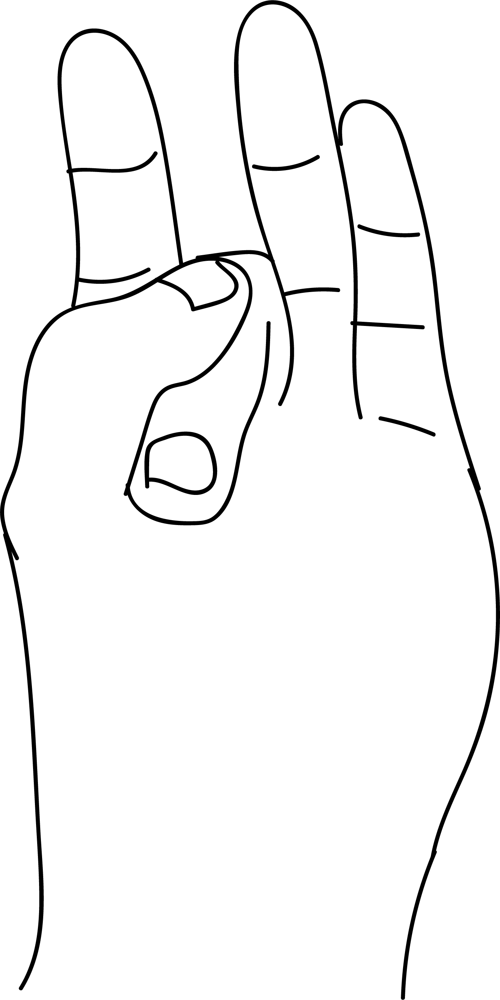

# Shoonya Mudra

[TOC]

Middle finger of the hand represents Ether-Space-Akash. Space is all over the world and in every cell in the body. The disterbance due to excess akasha element in the body, causes various types of diseases - like cardiac weakness, ear problems, vertido etc. and shoonya mudra helps resolve problems associated with an excess of the akasha element.

## Formation
The tip of the middle finger is to be placed at the base of the thumb and the thumb is to be placed on the back of the middle finger gently.

## Effects
The space element is reduced.

## Benefits
1. Ear ache subsides immediately
1. Audio weakness is remedied
1. Deafness is cured if it is not by birth
1. Numbness in the head, body parts, chest, abdomen can be remedied by this mudra
1. Ear ailments like pain, tinnitus (noises) acquired deafness will be certainly remedied
1. Vertido problem will be solved instantly when it is cured perform akasha mudra every day for 15 minutes.

## References

## References

1. **"MUDRAS & HEALTH PERSPECTIVES"** by ***"SUMAN.K.CHIPLUNKAR"*** page no 63
