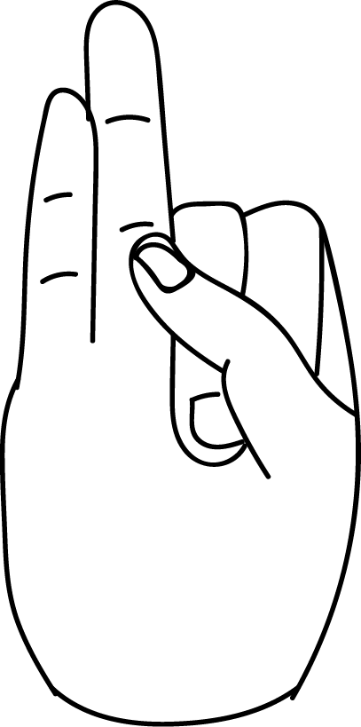

# Shoonya Vayu Mudra

[TOC]

**Shoonya vayu mudra** is the combination of shoonya and vayu mudras.

## Effects
Space is reduced by shoonya mudra and vayu is decreased by vayu mudra. This mudra helps to avoid illness.

## Benefits
1. This mudra can be used to overcome the following disorders:
1. Lack of stamina and endurance.
1. Indicisiveness, impatience, timidity and inexplicable fear.
1. Sleeplessness.
1. Imaciation, weight loss.
1. Numbness in body p;arts.
1. Unsteady gait, parkinson, giddiness, vertigo.
1. Creaking joints, osteo arthritis.
1. Cold,dry,cracked skin, nails, hair.
1. Irregular scanty, painful mensee.
1. Hoaeseness of voice, stammering.
1. Severe headache,ear pain, imbalance while walking, pain in the tooth, pain in the throat, pain in the heels, joint pain-shoonya and vayu mudras are to be performed together followed by prana mudra.
1. **Shoonya vayu mudra prevents all illnesses if practised daily for 15 minutes**.

## References

## References

1. **"MUDRAS & HEALTH PERSPECTIVES"** by ***"SUMAN.K.CHIPLUNKAR"*** page no 64
