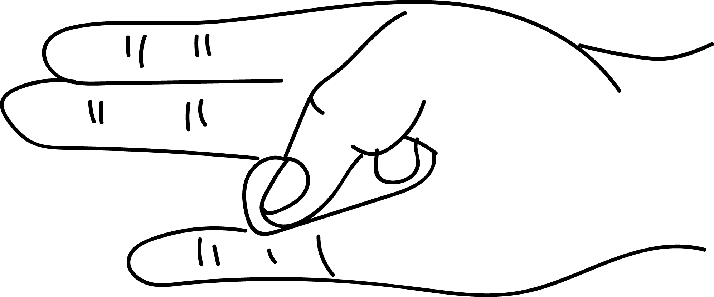

# Surya Mudra

[TOC]

Surya means - the Sun. Surya mudra generates heat in the body like Sun. This mudra decreases prithvi element and increases agni element.

## Formation
The tip of the ring finger is to be placed at the base of the thumb and thumb is to be placed gently on the back of the ring finger.

## Effects
The element agni is associated with body temperature and metabolism. Practice of soorya mudra helps to maintain the body temperature and keeps the metabolism going.
The element agni is also associated with vision. Hence, this mudra strengthens eyes and improves vision.

## Benefits
1. Surya mudra can treat following disorders:
1. Abnormally low body temperature.
1. Intolerance to cold, shivering.
1. Under activity of thyroid gland causing slow metabolism.
1. Obesity, progressive weight gain will be rectified.
1. Loss of appetite, indigestion and constipation.
1. Absence of sweating.
1. Cold problem like cough, tuberculosis, sinusitis, pleurisy and asthama.
1. High cholesterol in the blood.
1. Cataract.
1. This mudra can be combined with linga mudra for better results (5 minutes each, in succession).

## References

## References

1. **"MUDRAS & HEALTH PERSPECTIVES"** by ***"SUMAN.K.CHIPLUNKAR"*** page no 65
