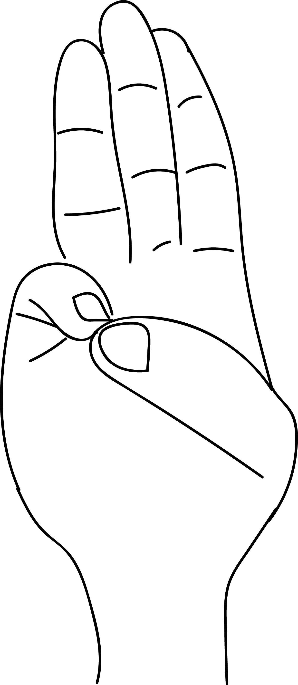

# Varuna Mudra

[TOC]

Almost 70% of the body is formed by water. Varuna mudra keeps the water balance in the body.
## Formation
Join the tip of the small finger with the tip of the thumb.

## Effects
Varuna mudra affects the water metabolism. It helps to rehydrate cells, tissues, muscles, skin, joints, cartilage etc. The element water, is associated with taste. This mudra is useful in overcoming disorders like loss of taste senses and dryness of mouth.

## Benefits
1. Dryness of the eyes.
1. Dryness of the digestive tract.
1. Dry cough.
1. dryness of the skin leading to cracks, dry enzema, psoriasis.
1. Degeneration of joint cartilage.
1. Osteo arthritis.
1. Anaemia and cramps.
1. Deficiency of harmones.
1. Scanty urination.
1. Loss of taste, tongue disorders.
1. Burns.
1. Pimples. itching and all skin diseases.
1. This mudra Preserves youthfulness.
1. Unconciousness due to sunstroke, accidents or overcrowedness can be cured by rubbing the tips of the thumbs and the tips of little fingers of the unconscious person.

## References

## References

1. **"MUDRAS & HEALTH PERSPECTIVES"** by ***"SUMAN.K.CHIPLUNKAR"*** page no 56
