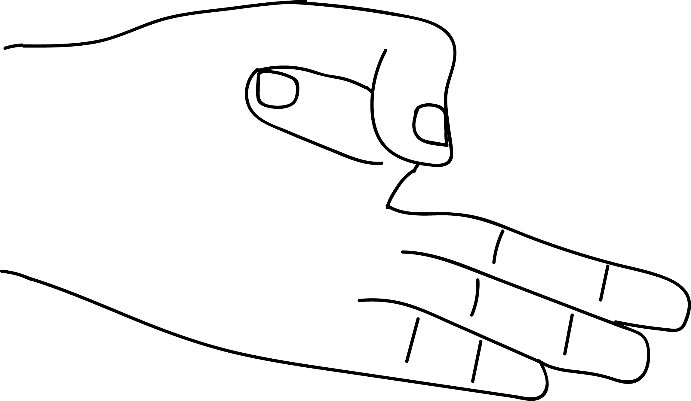

# Vayu Mudra

[TOC]

When the air element in the body increases because of diet or life style, many kinds of disturbances raise their ugly head. To decrease the vayu element perform vayu mudra and attain balance.

## Formation
Index finger tip is to be placed at the base of the thumb and the thumb is to be placed on the back of the index finger gently. Other fingers are to be straight. this is Vayu mudra.

## Effects
Excess vayu is decreased, blood circulation improves and any area of the body experiencing pain starts getting relief.

## Benefits
1. This mudra acts slowly but steadily. Within 8 to 10 days the results are attained.
1. When the vayu in our body accumulates in any part, it causes severe pain and aches. This mudra can cure such aches.
1. The feeling of restlessness or gas formation after meals can be cured if this mudra is practised immediately.
1. By yawning or by burping the vayu problem gets resolved.
1. Vayu diseases such as parkinsons, sciatica, paralysis, cervical spondylitis and knee pains get cured by this mudra by regular practice.
1. Relief from joint pain can be aachieved by practising these mudras in the following order:
* Vayu mudra for 15 minutes, followed by
* Varuna mudra for 15 minutes, followed by
* Prana mudra 15 minutes.
1. Varuna mudra helps in balancing the water elements in the cartilage of the joint.
1. Gout is cured with continuous practice of vayu mudra followed by prana mudra.
1. If you lift something very heavy perform vayu mudra for 5 minutes immediately.
1. If you experience a sprain due to a fall, perform vayu mudra with opposite hand and place samana mudra on the point of sprain. Samana mudra, performed by holding five fingers together, removes pain.
1. If you get hurt (say a bump on the head or pain in the leg by hitting something hard), perform vayu mudra using the hand that is opposite to the side of the hurt and place the samana mudra where there is pain.
1. Pain in the neck, frozen arm are cured by the vayu mudra followed by prana mudra.
1. Convulsions are cured by regular practice of vayu mudra daily for 15 minutes.

## References

## References

1. **"MUDRAS & HEALTH PERSPECTIVES"** by ***"SUMAN.K.CHIPLUNKAR"*** page no 62
