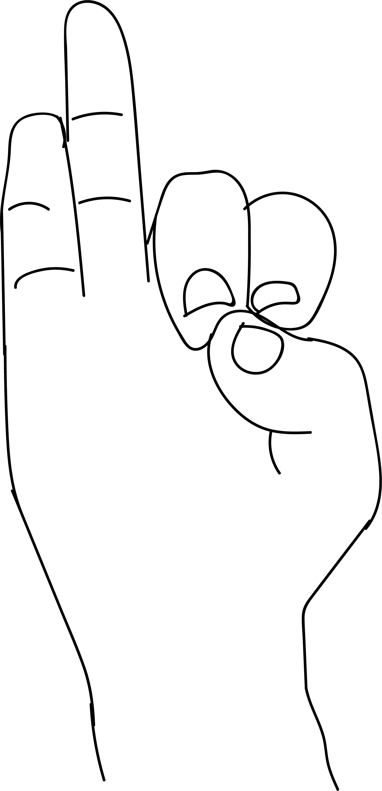

# Vyana Mudra

[TOC]

The curreny of air - Vyana vayu, in the venis and artaries is said to be the circulator of blood in the body. When this air current starts moving very fast in the lungs, arteries and venis the diseases is called the high blood pressure. Performing vyana mudra 2-3 times a day for 50 minutes each followed by prana mudra for 15 minutes helps in regulating blood pressure.

## Formation
The tips of index finger and middle fingers to be joined with the tip of the thumb.

## Benefits
1. Blood pressure either high or low is regulated and balanced.
1. Lack of initiative, enthusiasm, slowness of thoughts and perception is corrected with vyana mudra.
1. Drowsiness, excessive sleep is overcome.
1. Intolerance to heat, sunstroke can be averted.
1. Excessive sweating, thirst, urination, loose motions and menorrhagia can be overcome.

## References

## References

1. **"MUDRAS & HEALTH PERSPECTIVES"** by ***"SUMAN.K.CHIPLUNKAR"*** page no 57
